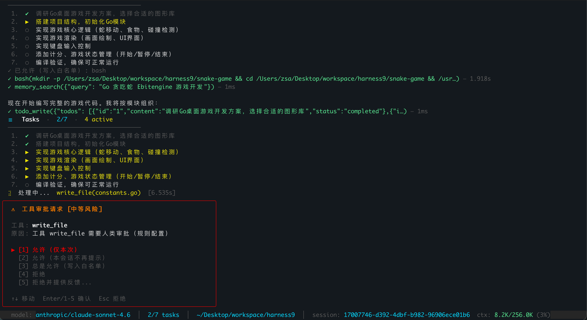
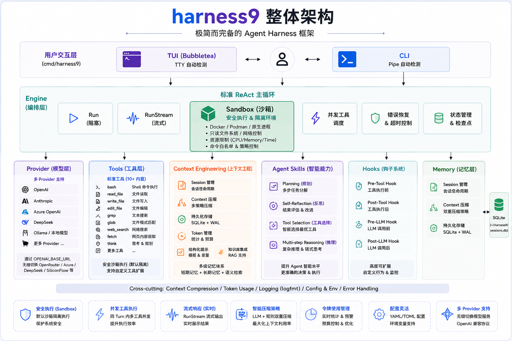

# harness9

**轻量级、功能完备、生产可用的 Go Agent Harness 框架**

---




---

## 为什么选择 harness9？

大多数 Agent 框架要么过于臃肿（满屏抽象层、数百个依赖），要么过于简陋（仅能跑个 demo）。harness9 走中间路线：


| 原则       | 说明                           |
| -------- | ---------------------------- |
| **简洁**   | 最小化抽象层，代码直白易读，极少的直接依赖        |
| **完备**   | 覆盖 Agent 运行所需的全部核心模块         |
| **生产可用** | 错误恢复、上下文管理、超时控制、并发工具执行等生产级特性 |


---

## 快速开始

```bash
# 安装
curl -fsSL https://raw.githubusercontent.com/ZhangShenao/harness9/master/scripts/install.sh | bash

# 配置 API Key
export OPENAI_API_KEY="sk-..."

# 进入你的项目目录并启动
cd /your/project && harness9
```

> 完整安装选项、Anthropic/OpenRouter 配置、AGENTS.md 设置和常见问题，见 [快速启动指南](docs/核心功能/quick_start.md)。

---

## 核心特性

### 全屏 TUI

在 TTY 中直接运行，自动进入全屏 TUI：欢迎页 → 对话页双 Phase 切换，流式输出逐 token 追加，工具执行期间实时 Spinner + 耗时计数。

- `Tab` 键补全命令和 Skill 名称
- `Ctrl-C` 中断 Agent，再按一次退出
- 非 TTY 环境（管道、CI）自动退回 CLI REPL 模式

详见 [TUI 交互界面实现原理](docs/核心功能/tui.md)。

### Shell 执行（`!` 前缀）

在对话框中直接运行 Bash 命令，无需切换终端：

```
› !git log --oneline -5
$ git log --oneline -5
a1b2c3d feat: add shell execution
...
  ✓ 完成 — 12ms
```

输入 `!` 时 TUI 自动切换 Shell 模式（状态栏变深绿、输入区显示 `[SHELL] $` 徽章）。命令输出追加到对话流，并在下次向 LLM 发送消息时自动注入上下文，Agent 可直接引用命令结果进行推理。

- 异步执行，不阻塞 TUI，默认 30s 超时
- vim/ssh 等交互式命令自动拦截，提示在独立终端运行
- `Esc` 退出 Shell 模式，`Enter` 执行命令

详见 [Shell 执行功能技术方案](docs/核心功能/shell-execution.md)。

### Context Engineering（上下文管理）

对话历史自动持久化到 SQLite（`~/.harness9/sessions.db`），进程重启后可通过 `/resume` 恢复。

```
ctx: 45.2K/128K (35%)  ← 绿色：正常
ctx: 92.1K/128K (72%)  ← 黄色：警告，即将压缩
```

**LLM 摘要压缩**（默认）：上下文超过 80% 时自动调用 LLM 生成结构化摘要，保留关键语义后继续会话，远优于简单截断；Provider 不可用时自动回退到 `TokenBudgetCompactor`。

```
⚡ 上下文已压缩 — 12.5K → 6.2K tokens（45 → 22 条消息）
```

会话命令：`/new` 开启新会话，`/resume` 恢复历史。

详见 [Context Engineering 技术方案](docs/核心功能/context-engineering.md)。

### Agent Skills（按需加载的领域知识）

在 `skills/<name>/SKILL.md` 下放置领域知识，Agent 按需加载，System Prompt 始终精简：

```
skills/
├── refactor-guide/SKILL.md    # 重构规范
└── testing-standards/SKILL.md # 测试标准
```

详见 [Agent Skills 设计原理](docs/核心功能/agent-skills.md)。

### Planning 模块（先规划、再执行）

通过 `Shift+Tab` 切换到 Plan Mode（状态栏显示 `[PLAN]`，色调切换为琥珀黄）。

```
用户：帮我写一个 Go Web API

[PLAN]  分析请求 → read_file/bash 只读探索
        → todo_write 生成实现计划
        → 文字简述后停止

        ╭──────────────────────────────────────╮
        │  Plan Mode 完成 — 选择下一步操作      │
        │  [1] 批准并自动执行                  │
        │  [2] 批准并逐步确认编辑               │
        │  [3] 继续修改计划                    │
        │  [4] 取消                            │
        ╰──────────────────────────────────────╯

批准后 Agent 按清单逐项执行，todo 快照实时追加在对话流中：

  ✓ todo_write({...}) — 0s
  ☰  Tasks  ·  3/11  ·  1 active
   1.  ✔  创建目录结构
   2.  ✔  初始化 go.mod
   3.  ▶  实现 main.go
```

- **工具层权限控制**：Plan Mode 下 `write_file`、`edit_file` 被从工具列表移除，无论 prompt 如何，LLM 根本看不到写工具
- **作弊防护**：`todo_write` 校验状态转换，`pending → completed` 直跳被拒绝，LLM 必须经过 `in_progress` 才能完成条目
- **停滞检测**：连续 3 次 `EventDone` 无进度后停止自动执行，提示手动干预

详见 [Planning 模块实现原理](docs/核心功能/planning.md)。

### 文件系统能力（Context Offload + Plan 持久化）

工具输出超过阈值（默认 10,000 字符）时，**OffloadHook** 自动将完整内容写入文件，context 中仅保留摘要引用和预览，防止单次输出爆炸 context 窗口：

```
  ✓ bash(grep -r "TODO" .) — 1.2s
[输出已保存至 ~/.harness9/tool_results/{sessionID}/{id}.txt，共 847 行 / 32416 字节。
预览（前 20 行）：
...
```

LLM 可通过 `read_file` 的 `offset/limit` 参数分页检索完整内容：

```json
read_file({"path": "~/.harness9/tool_results/.../id.txt", "offset": 4096, "limit": 4096})
```

**FilePlanWriter** 在每次 `todo_write` 写入后将执行计划同步输出为 markdown 文件：

```markdown
# 执行计划
session: abc12345
updated: 2026-05-22T15:30:00+08:00

## 任务列表
- [x] 创建目录结构
- [>] 实现 main.go
- [ ] 编写测试
```

- **Git 项目**写入 `{workDir}/.harness9/plans/`，纳入版本控制
- 删除会话时自动级联清理 offload 文件，无磁盘残留

详见 [文件系统能力技术方案](docs/核心功能/file-system.md)。

### 标准 ReAct 循环

每个 Turn 执行一次 LLM 调用（携带完整工具列表），工具结果作为 Observation 注入上下文，驱动下一轮推理：

```
Turn N: LLM(messages, tools) → Action → 并发执行工具 → Observation → Turn N+1
自然终止：模型不再发起工具调用 → 输出最终回复
```

详见 [Agent Loop 核心实现原理](docs/核心功能/agent-loop.md)。

### 并发工具执行 + 自愈能力

同一 Turn 内多个工具并发执行，每个工具独立超时控制。执行失败时，错误信息原样回传给 LLM 触发自动重试。

详见 [Tool Calling 工具调用系统](docs/核心功能/tool-calling.md)。

### 流式输出

`Run`（阻塞）和 `RunStream`（流式）双模式，共享同一引擎实例：

```go
stream, _ := eng.RunStream(ctx, prompt)
for evt := range stream {
    switch evt.Type {
    case engine.EventActionDelta:
        fmt.Print(evt.Data.(string))
    case engine.EventDone:
        return
    }
}
```

---

## 架构总览



---

## 核心模块


| 模块             | 说明                                                                                      | 状态  |
| -------------- | --------------------------------------------------------------------------------------- | --- |
| **TUI**        | 全屏 TUI（Bubbletea）：双 Phase、流式输出、Spinner + 精确耗时、Tab 补全、Token 用量实时展示、Shell 执行模式（`!` 前缀）| ✅   |
| **Engine**     | 标准 ReAct 主循环，阻塞 + 流式双模式，EventTokenUpdate / EventCompaction / EventToolResult（精确耗时）事件   | ✅   |
| **Hooks**      | 工具拦截器：OffloadHook（超大输出 offload）+ FilePlanWriter（计划持久化）+ HookRegistry（洋葱模型）               | ✅   |
| **Planning**   | Plan Mode（先规划后执行）、TodoStore、todo_write 工具、PlanWriter 接口、工具层权限过滤、自动续跑 + 停滞检测           | ✅   |
| **Memory**     | SQLiteSession（WAL）、Manager（WithToolResultsDir + DeleteSession GC）、SummarizationCompactor（默认，LLM 摘要）、TokenBudgetCompactor（回退） | ✅   |
| **Context**    | System Prompt 结构化组装（基础 + AGENTS.md + Skills 索引 + todo 指引 + offload 检索指引）                | ✅   |
| **Skills**     | Skills 解析、索引、按需加载（`use_skill` 工具）                                                       | ✅   |
| **Provider**   | LLM 统一接口，OpenAI / Anthropic 适配器，实际 token 用量提取                                           | ✅   |
| **Schema**     | 跨组件共享的核心数据类型（Message、ToolCall、Usage 等）                                                  | ✅   |
| **Tools**      | 工具注册表 + 内置工具（bash / read_file（offset/limit 分页）/ write_file / edit_file）                 | ✅   |
| **Env**        | 零依赖 `.env` 配置加载器                                                                        | ✅   |


---

## 项目结构

```
harness9/
├── cmd/harness9/
│   ├── main.go              # 程序入口：TUI（TTY）/ CLI（管道）自动检测
│   ├── tui.go               # TUI 核心：tuiModel、Init、RunTUI、包级样式变量
│   ├── tui_update.go        # Update 逻辑：事件、键盘、滚动、Tab 补全、Shell 执行
│   ├── tui_view.go          # View 渲染：对话区 / StatusBar / Input / Footer
│   ├── tui_banner.go        # WelcomeBanner：HARNESS9 ASCII Art
│   ├── cli.go               # 交互式 CLI REPL 实现
│   └── upgrade.go           # 自动升级：GitHub Releases API + SHA256 校验 + 原子替换
├── internal/
│   ├── engine/              # ReAct 主循环（Run + RunStream + ToolResultData）
│   ├── hooks/               # 工具拦截器（OffloadHook + FilePlanWriter + HookRegistry）
│   ├── planning/            # PlanMode 枚举 + TodoStore + PlanWriter 接口
│   ├── memory/              # Session 持久化 + Compactor 压缩策略 + DeleteSession GC
│   ├── provider/            # OpenAI / Anthropic 适配器 + 模型限制注册表
│   ├── schema/              # 共享数据类型（Message、StreamChunk、Usage）
│   ├── tools/               # 工具注册表 + 内置工具（read_file 支持 offset/limit）+ 路径沙箱
│   ├── context/             # System Prompt 组装（DefaultPromptBuilder + WithOffloadEnabled）
│   ├── skills/              # Skills 解析、索引、use_skill 工具
│   ├── env/                 # 零依赖 .env 加载器
│   └── logfmt/              # 块状日志格式化
├── docs/核心功能/            # 技术文档
├── skills/                  # 示例 Skills（可直接复制到项目中使用）
├── AGENTS.md                # 项目开发规范（自动注入 System Prompt）
└── CLAUDE.md -> AGENTS.md   # 符号链接，保持同步
```

---

## 文档索引


| 文档                                                           | 内容                                                   |
| ------------------------------------------------------------ | ---------------------------------------------------- |
| [快速启动指南](docs/核心功能/quick_start.md)                           | 安装、API Key 配置、TUI 首次使用、基本命令、常见问题                          |
| [TUI 交互界面实现原理](docs/核心功能/tui.md)                             | Bubbletea 架构、布局、事件流、键盘交互                                |
| [CLI 使用指南](docs/核心功能/cli.md)                                 | 启动、环境变量、AGENTS.md、Skills 配置                             |
| [Agent Skills 设计原理](docs/核心功能/agent-skills.md)               | Progressive Disclosure、frontmatter 规范、use_skill 工具      |
| [Agent Loop 核心实现原理](docs/核心功能/agent-loop.md)                 | 标准 ReAct 设计原理、PromptBuilder、流式架构                        |
| [Tool Calling 工具调用系统](docs/核心功能/tool-calling.md)             | 工具接口、并发模型、内置工具详解、扩展指南                                   |
| [Context Engineering 技术方案](docs/核心功能/context-engineering.md) | SQLiteSession、SummarizationCompactor、Token 估算、并发安全设计    |
| [Planning 模块实现原理](docs/核心功能/planning.md)                      | Plan Mode、TodoStore、工具层权限控制、自动续跑、停滞检测、跨会话持久化            |
| [文件系统能力技术方案](docs/核心功能/file-system.md)                         | OffloadHook、FilePlanWriter、read_file 分页、Session GC、Hooks 扩展 |
| [Shell 执行功能技术方案](docs/核心功能/shell-execution.md)                   | `!` 前缀触发、异步执行机制、LLM 上下文注入、截断策略、交互式命令拦截          |
| [AGENTS.md](AGENTS.md)                                       | 项目开发规范、编码标准、架构决策                                        |


---

## 对标框架


| 框架                | 与 harness9 的差异                                    |
| ----------------- | ------------------------------------------------- |
| Claude Agent SDK  | 官方 SDK，仅支持 Anthropic；harness9 多 Provider，Go 原生    |
| OpenAI Agents SDK | Python，Handoffs 多 Agent；harness9 Go 原生单 Agent，更轻量 |
| OpenHarness       | Python；harness9 Go 原生                             |
| OpenCode          | TypeScript；harness9 标准 ReAct，Go 原生                |


---

## License

MIT
