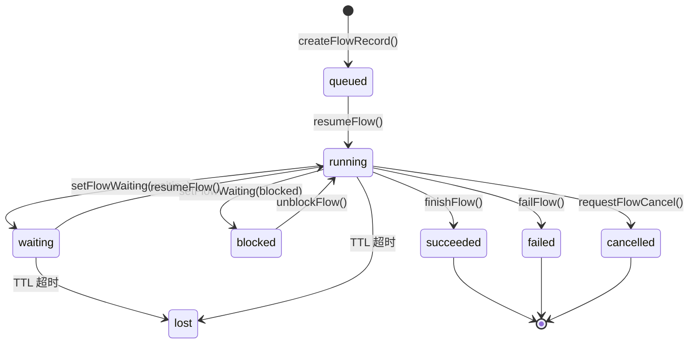

# Agent Harness 框架 Planning 模块深度调研

## 执行摘要

本报告对六个主流 Agent Harness 框架的 Planning（规划）模块进行系统性深度调研，覆盖规划创建、持久化、纠偏、执行模式和生命周期五个核心维度。调研基于各框架的 GitHub 源代码、官方文档及 API 文档实时采集，所有结论均有一手来源支撑。

主要发现：

1. **无统一范式**：六个框架在 planning 实现上差异显著——从简单 TodoList（HermesAgent）到完整 TaskFlow 状态机（OpenClaw），体现了不同的设计权衡
2. **Plan Mode 已成共识**：Claude Code / OpenCode 均引入了专门的 Plan Mode（只读探索模式），这是防止 LLM 过早写文件的重要安全机制
3. **工具即接口**：所有框架都通过工具调用（Tool Call）而非内置指令来触发 planning 行为，保持了 LLM 接口的一致性
4. **持久化策略分化**：从纯内存（HermesAgent TodoStore）到 SQLite（OpenClaw task-registry）再到云端（Claude Ultraplan），持久化深度与框架定位强相关
5. **harness9 缺口明确**：当前 harness9 完全缺乏 planning 能力，本报告末尾提供针对性的 Go 实现建议

---

## 目录

1. [调研框架总览](#调研框架总览)
2. [DeepAgents（LangChain）](#deepagents)
3. [OpenHarness（HKUDS）](#openharness)
4. [OpenCode（Anomaly）](#opencode)
5. [OpenClaw](#openclaw)
6. [HermesAgent（NousResearch）](#hermesagent)
7. [Claude Agent SDK（Anthropic）](#claude-agent-sdk)
8. [横向对比分析](#横向对比分析)
9. [harness9 设计建议](#harness9-设计建议)

---

## 调研框架总览

| 框架 | 语言 | Planning 方案 | Plan Mode | 持久化 | 成熟度 |
|------|------|---------------|-----------|--------|--------|
| DeepAgents | Python | TodoListMiddleware + 工具提示 | 无专门模式 | 无 | 中 |
| OpenHarness | Python | Plan SubAgent + AutopilotService | EnterPlanMode 工具 | JSON 文件 | 高 |
| OpenCode | TypeScript | Plan Agent + Todo Service | plan permission mode | SQLite (Drizzle) | 高 |
| OpenClaw | TypeScript | TaskFlow 状态机 + TaskRegistry | 无，靠权限控制 | SQLite | 高 |
| HermesAgent | Python | TodoStore + Kanban | 无专门模式 | 内存 + Kanban DB | 高 |
| Claude Agent SDK | TypeScript/Python | TodoWrite → TaskCreate/Update | plan mode (permission) | JSONL session | 最高 |

---

## DeepAgents

**仓库**: https://github.com/langchain-ai/deepagents  
**核心文件**: `libs/deepagents/deepagents/graph.py`, `middleware/subagents.py`, `profiles/harness/`

### 1. Planning 的创建时机与方式

DeepAgents 采用**提示工程驱动的隐式 planning**，没有显式的 plan 创建工具或 API。

**触发机制**：完全由 LLM 自主判断。框架通过 `TodoListMiddleware` 在系统提示中注入 `write_todos` 工具，模型可在认为有必要时调用该工具记录任务清单。

```
# DeepAgents 的 TodoListMiddleware 基本概念（推断自源码注释）
base_middleware_stack = [
    TodoListMiddleware,     # 注入 write_todos 工具到工具列表
    FilesystemMiddleware,   # 文件访问
    SubagentsMiddleware,    # 子 Agent 委托
    SummarizationMiddleware # 上下文压缩
]
```

**Plan 数据结构**：简单的任务列表，存储于 LangGraph 状态图的 `_DeepAgentState` 中，无独立的 plan 实体。

**Sub-Agent 任务委托**：DeepAgents 通过 `task` 工具将子任务委托给独立的 sub-agent：
- 触发条件：当任务"复杂、多步骤且可独立完成"时
- 委托方式：父 Agent 调用 `task` 工具，传入详细的 `description` 参数
- 并行策略：明确鼓励并行执行独立步骤（"whenever you have independent steps, kick off tasks in parallel"）
- 上下文隔离：子 Agent 状态键（`skills_metadata`、`memory_contents`）被显式排除，防止父状态泄露

### 2. Planning 的持久化方案

- **存储位置**：无持久化，Plan 状态存在于 LangGraph 的 `_DeepAgentState`（内存中）
- **序列化格式**：LangGraph 状态本身是 Python 字典，可通过 LangGraph 的持久化后端（checkpoint）保存，但框架本身不强制要求
- **跨会话恢复**：依赖 LangGraph 的 checkpoint 机制（可选，用户自行配置）
- **与 Session 的关系**：Plan 是 Session 的一部分，没有独立的生命周期

### 3. Planning 的更新与纠偏机制

- **状态更新**：通过 LLM 再次调用 `write_todos` 工具覆盖更新任务列表
- **纠偏方式**：无自动纠偏，依赖 LLM 自主判断是否需要重新规划
- **工具执行失败处理**：SubagentsMiddleware 捕获子 Agent 错误，通过 `_messages_reducer.py` 将结果（包括错误信息）合并回主 Agent 的消息历史，LLM 可据此调整计划
- **LLM 感知 Plan 状态**：通过消息历史（工具调用结果）间接感知

### 4. Plan Mode / Auto Mode

DeepAgents **没有专门的 Plan Mode**。所有操作在同一模式下执行。

通过 `FilesystemPermission` 系统可以配置文件访问权限，但这是声明式权限约束，不是执行模式切换。

```python
# FilesystemPermission 可限制写入，但这是配置层面，非模式切换
FilesystemPermission(
    read_only=True,  # 此参数可实现类似 plan mode 的效果
    ...
)
```

### 5. Plan 的生命周期管理

- **状态机**：无正式状态机，任务状态仅通过工具返回文本隐式表达
- **嵌套子任务**：通过 Sub-Agent 树形结构实现，但无统一的嵌套任务 API
- **完成后清理**：无；Sub-Agent 完成后结果合并到父 Agent 消息历史
- **并发 Plan**：支持（通过 AsyncSubagentsMiddleware 并行执行）

### 优势与不足

**优势**：
- 与 LangGraph 深度集成，可利用 LangGraph 的状态持久化和断点续传
- TodoListMiddleware 设计简洁，侵入性低

**不足**：
- Planning 机制过于隐式，LLM 可能忽略不用 `write_todos` 工具
- 无 Plan Mode 安全边界，LLM 可能在"规划阶段"就开始写文件
- Plan 数据结构不固定，无法机器解析当前计划状态

---

## OpenHarness

**仓库**: https://github.com/HKUDS/OpenHarness  
**核心文件**: `src/openharness/coordinator/`, `src/openharness/autopilot/`, `src/openharness/tasks/`

OpenHarness 是调研框架中 planning 机制最完整的。它实现了**三层 planning 架构**：交互式 Plan Mode、专用 Plan SubAgent、自动化 AutopilotService。

### 1. Planning 的创建时机与方式

**三种触发机制**：

**a) 交互式 Plan Mode（`/plan` 命令）**：用户主动触发，通过 `EnterPlanMode` 工具进入只读规划状态。进入后 Agent 只能执行读操作，生成实现方案后通过 `ExitPlanMode` 工具退出并开始执行。

**b) Plan SubAgent（专用规划子 Agent）**：

```python
# coordinator/agent_definitions.py 中的 Plan Agent 定义
Plan = AgentDefinition(
    name="Plan",
    description="Software architect agent for designing implementation plans. "
                "Use this when you need to plan the implementation strategy for a task.",
    system_prompt="""
    # Planning Agent
    
    You are a software architect specializing in implementation planning.
    
    ## Workflow
    1. Requirements Understanding - analyze provided specs
    2. Codebase Exploration - identify existing patterns via Glob, Grep, Read
    3. Solution Design - evaluate trade-offs
    4. Plan Detailing - sequential strategy with dependencies
    
    ## Output Format
    End with "Critical Files for Implementation" (3-5 files)
    """,
    tools=["Glob", "Grep", "Read"],  # 严格只读工具
    allowed_operations=["read"],      # 明确禁止写操作
)
```

**c) AutopilotService（自动化规划）**：后台持续运行，从 GitHub Issues/PRs、手动请求等来源自动采集任务并调度执行。

**Plan 数据结构**：

```python
# tasks/types.py
@dataclass
class TaskRecord:
    identifier: str          # 任务唯一 ID
    task_type: TaskType       # "local_bash" | "local_agent" | "remote_agent" | ...
    status: TaskStatus        # "pending" | "running" | "completed" | "failed" | "killed"
    description: str          # 任务描述
    working_dir: str
    output_path: str          # 输出文件路径
    command: str | None       # shell 命令（bash 类型任务）
    agent_prompt: str | None  # agent 提示（agent 类型任务）
    created_at: datetime | None
    started_at: datetime | None
    ended_at: datetime | None
    exit_code: int | None
    env: dict | None
    metadata: dict | None

# autopilot/types.py  
class RepoTaskCard(BaseModel):
    identifier: str
    fingerprint: str         # 用于去重
    title: str
    description: str
    source: RepoTaskSource   # "ohmo_request" | "manual_idea" | "github_issue" | ...
    status: RepoTaskStatus   # 14 个状态值（见下文）
    score: float             # 任务优先级分数
    labels: list[str]
    created_at: datetime
    updated_at: datetime
```

**任务评分系统**：
```python
# autopilot/service.py 中的基础分数
BASE_SCORES = {
    "ohmo_request": 100,   # 最高优先级：直接请求
    "github_pr": 85,
    "manual_idea": 80,
    "github_issue": 75,
    "claude_code_candidate": 45,  # 最低：AI 自动发现
}
# 动态加分：紧急关键词、bug 标记、新鲜度等
```

### 2. Planning 的持久化方案

- **Tasks（后台任务）**：存储在内存中，通过输出文件（`output_path`）在磁盘上留存结果
- **AutopilotService 任务卡**：以 JSON 格式序列化保存到 `RepoAutopilotRegistry`（JSON 文件），定期刷新
- **Plan SubAgent 的输出**：纯文本，存储于父 Agent 的消息历史中
- **跨会话恢复**：AutopilotService 通过 JSON 注册表恢复任务卡状态；交互式 Plan 不跨会话持久化

```python
# AutopilotRegistry JSON 格式（推断自 types.py）
{
    "version": 1,
    "updated_at": "2026-05-20T...",
    "cards": [
        {
            "identifier": "task-001",
            "status": "running",
            "score": 85.0,
            "attempt_count": 1,
            ...
        }
    ]
}
```

### 3. Planning 的更新与纠偏机制

**状态机转换（AutopilotService）**：
```
queued → accepted → preparing → running → verifying → pr_open → waiting_ci
                                                     ↓ (失败)
                                              repairing (最多 3 次重试)
                                                     ↓ (超限)
                                                   failed
```

**自动修复逻辑**：
```python
# autopilot/service.py
max_attempts = 3
# 失败时：重试并附带先前上下文
if card.status in ["failed", "repairing"] and card.attempt_count < max_attempts:
    update_status(card_id, "repairing", metadata_updates={"prior_context": ...})
```

**验证门控**：执行完成后自动运行验证命令（pytest、ruff、TS 检查），失败则触发重试。

**Coordinator 的四阶段工作流**：
```
研究阶段  → 合成阶段    → 实现阶段    → 验证阶段
(并行探索)  (协调者分析)  (定向实现)  (测试验证)
```

### 4. Plan Mode / Auto Mode

**Plan Mode（交互式）**：
```python
# coordinator/coordinator_mode.py
def is_coordinator_mode() -> bool:
    return os.environ.get("CLAUDE_CODE_COORDINATOR_MODE", "").lower() in ("1", "true", "yes")

# Plan Mode 工具（推断）
tools_in_plan_mode = ["Glob", "Grep", "Read", "EnterPlanMode", "ExitPlanMode"]
# 显式禁止：Write、Edit、Bash（写操作）
```

**Auto Mode（Autopilot）**：完全自动化，无需用户确认。适用于批量任务处理。

**Coordinator Mode**：多 Agent 协作模式，Coordinator 拥有专属工具：
- `agent` — 生成新 worker
- `send_message` — 向已有 worker 发送消息
- `task_stop` — 终止 worker

**Human-in-the-loop**：AutopilotService 在 verifying 阶段失败后可设置 `status="blocked"` 等待人工介入。

### 5. Plan 的生命周期管理

**AutopilotService 完整状态机**：
```
queued → accepted → preparing → running → verifying → pr_open → waiting_ci → completed/merged
                                                     ↓
                                              repairing (最多3次)
                                                     ↓
                                                   failed
                                                     ↓
                                                  rejected
```

另有 `superseded`（被新版任务取代）状态，支持任务去重和版本管理。

**并发 Plan 管理**：AutopilotService 通过优先级排序选取下一个任务（`pick_next_card()`），不支持真正意义上的并发执行（同时只执行一个任务）。

---

## OpenCode

**仓库**: https://github.com/anomalyco/opencode（主要观察 dev 分支）  
**核心文件**: `packages/opencode/src/agent/agent.ts`, `packages/opencode/src/session/todo.ts`

### 1. Planning 的创建时机与方式

OpenCode 将 planning 实现为一个专用的**只读 Agent 模式**，通过权限系统强制执行。

**Plan Agent 定义**（来自 `packages/opencode/src/agent/agent.ts`）：
```typescript
// Plan Agent 的权限配置
const planAgentPermissions = {
    question: "allow",      // 可以提问
    plan_exit: "allow",     // 可以退出 plan mode
    edit: { "*": "deny" },  // 禁止所有编辑
    // 唯一例外：允许写入 .opencode/plans/*.md（记录计划文档）
    "edit:.opencode/plans/*.md": "allow",
};

// Build Agent（默认执行模式）
const buildAgentPermissions = {
    question: "allow",
    plan_enter: "allow",   // 可以进入 plan mode
    // edit 不受限制
};
```

**Todo 管理工具**：`TodoWrite` 工具（通过 `todo.ts` 服务）：

```typescript
// packages/opencode/src/session/todo.ts（推断自源码）
interface TodoItem {
    content: string;
    status: "pending" | "in_progress" | "completed" | "cancelled";
    priority: "high" | "medium" | "low";
}

// Service 层
class TodoService {
    update(sessionId: string, todos: TodoItem[]): Effect<void>
    get(sessionId: string): Effect<TodoItem[]>
}
```

**触发时机**：
- Plan Mode：用户通过 Tab 键切换到 plan agent，或在 prompt 中指定 `@plan`
- Todo：LLM 自主判断，对复杂任务自动调用 `TodoWrite`
- 完全自动：Build Agent 在遇到复杂任务时自动调用 `TodoWrite` 记录步骤

### 2. Planning 的持久化方案

- **Todo 列表**：通过 Drizzle ORM 持久化到 **SQLite**（`TodoTable`）
- **Plan 文档**：写入 `.opencode/plans/*.md` 文件（Markdown 格式）
- **Session 关联**：Todo 条目通过 `sessionId` 与会话绑定
- **事件总线**：状态变更通过 `todo.updated` 事件广播，实现实时 UI 同步
- **跨会话恢复**：Todo 存储在数据库中，会话恢复时自动加载历史 Todo

```typescript
// 数据库 schema（推断自 Drizzle 用法）
const TodoTable = sqliteTable("todo", {
    id: text("id").primaryKey(),
    sessionId: text("session_id").notNull(),
    content: text("content").notNull(),
    status: text("status").notNull(),  // pending|in_progress|completed|cancelled
    priority: text("priority").notNull(),
    position: integer("position").notNull(),
});
```

### 3. Planning 的更新与纠偏机制

- **状态更新**：LLM 通过再次调用 `TodoWrite` 工具更新 Todo 状态
- **原子操作**：`update()` 方法先删除会话所有 Todo，再全量插入（类似 write-replace 语义）
- **纠偏方式**：LLM 自主判断，可通过 `plan_exit` + 重新 `plan_enter` 修改计划
- **Plan Mode 防护**：Plan Mode 下写操作被权限系统拒绝，LLM 无法意外修改代码

### 4. Plan Mode / Auto Mode

**Plan Mode（permission mode）**：
- 触发：Tab 键切换或 `--permission-mode plan`
- 限制：仅允许读操作（`Glob`、`Grep`、`Read`、`WebSearch`）
- 输出：可写入 `.opencode/plans/` 目录保存计划文档
- 退出：调用 `plan_exit` 工具或再次 Tab 键切换

**Build Mode（default）**：
- 完整工具访问权限
- 含 `plan_enter` 工具（可切换到 plan mode）

**无 Auto Mode**：OpenCode 没有自动绕过确认的模式（不同于 Claude Code 的 auto permission mode）。

### 5. Plan 的生命周期管理

- **Todo 状态机**：`pending → in_progress → completed / cancelled`（单向，但代码不强制校验）
- **Plan 文档**：`.opencode/plans/*.md` 文件在执行完成后保留（不自动清理）
- **多并发 Plan**：Plan 文档按文件名区分，理论上支持多个；Todo 列表按 session 区分
- **清理策略**：无自动清理，Plan 文档作为历史记录保留

---

## OpenClaw

**仓库**: https://github.com/openclaw/openclaw  
**核心文件**: `src/tasks/task-registry.ts`, `src/tasks/task-flow-registry.ts`, `src/trajectory/`

OpenClaw 是调研框架中 **planning 机制最工程化**的。它实现了完整的 **TaskFlow 状态机**，将"计划"（Flow）和"执行步骤"（Task）分离建模。

### 1. Planning 的创建时机与方式

OpenClaw 的 planning 完全由**程序驱动**，不依赖 LLM 自主判断是否规划。

**TaskFlow（计划）数据结构**：
```typescript
// src/tasks/task-flow-registry.ts
interface TaskFlowRecord {
    flowId: string;
    ownerKey: string;
    syncMode: "managed" | "task_mirrored"; // 计划驱动 vs 任务镜像
    status: FlowStatus;   // queued|running|waiting|blocked|succeeded|failed|cancelled|lost
    goal: string;         // 计划目标描述
    currentStep: string;  // 当前执行步骤 ID
    revision: number;     // 乐观并发控制版本号
    stateJson: string;    // 执行上下文（JSON 序列化）
    waitJson: string;     // 等待状态（JSON 序列化）
    blockedTaskId: string | null;
    blockedSummary: string | null;
    controllerId: string | null;
    cancelRequestedAt: Date | null;
    createdAt: Date;
    updatedAt: Date;
    endedAt: Date | null;
}
```

**TaskRecord（执行步骤）数据结构**：
```typescript
// src/tasks/task-registry.ts
interface TaskRecord {
    taskId: string;
    runId: string;
    taskKind: string;
    ownerKey: string;
    scopeKind: "session" | "system";
    requesterSessionKey: string;
    status: TaskStatus;  // queued|running|succeeded|failed|timed_out|cancelled|lost
    parentFlowId: string | null;   // 关联的 TaskFlow
    parentTaskId: string | null;   // 父任务（嵌套）
    childSessionKey: string | null;
    terminalOutcome: "succeeded" | "blocked" | null;
    error: string | null;
    createdAt: Date;
    startedAt: Date | null;
    endedAt: Date | null;
    lastEventAt: Date;
}
```

**TaskFlowRecord 与 TaskRecord 的关系**：
```
TaskFlowRecord（计划/Flow）
    ├── goal: "实现用户认证功能"
    ├── status: "running"
    └── Tasks[]（执行步骤）
            ├── Task-001: "分析现有认证代码" (succeeded)
            ├── Task-002: "实现 JWT 中间件" (running)
            └── Task-003: "编写测试" (queued)
```

### 2. Planning 的持久化方案

- **存储**：完全持久化到 **SQLite**（`task-registry.store.sqlite.ts`）
- **索引**：7 个专用索引（按 runId、ownerKey、parentFlowId 等），支持高效查询
- **乐观并发**：`revision` 字段防止并发修改冲突
- **审计日志**：`task-registry.audit.ts` 记录所有状态变更
- **Session 关联**：Task 通过 `ownerKey` / `requesterSessionKey` 与 Session 绑定

```typescript
// task-registry.store.sqlite.ts 的持久化操作
const store = {
    createTask(record: TaskRecord): Promise<void>,
    updateTask(taskId, patch, expectedRevision): Promise<ConflictError | void>,
    getTask(taskId): Promise<TaskRecord | null>,
    queryTasks(filter: TaskFilter): Promise<TaskRecord[]>,
    // ...
};
```

### 3. Planning 的更新与纠偏机制

**TaskRecord 状态机**：
```
queued → running → succeeded
                 → failed
                 → timed_out
                 → cancelled
                 → lost
```

关键约束：`shouldApplyRunScopedStatusUpdate()` 确保终态不可回退（`succeeded` 可转为 `lost` 是唯一例外）。

**TaskFlow 纠偏机制**：
```
queued → running → waiting (等待依赖完成)
                 → blocked (需要人工介入)
                 → succeeded
                 → failed
                 → cancelled
```

**依赖门控**：Task 完成后，`syncManagedFlowCancellationFromTask()` 检查同级 Task 状态，如所有 sibling Task 均完成则推进 Flow。

**人工介入**：Task 可设置 `terminalOutcome: "blocked"` + `blockedSummary`，暂停整个 Flow 等待用户处理。

**流传播**：Task 失败时可通过 `cancelRequestedAt` 触发 Flow 级取消，支持级联取消所有相关 Task。

### 4. Plan Mode / Auto Mode

OpenClaw **没有专门的 Plan Mode**，而是通过以下机制实现类似效果：

- **权限系统**：`task-owner-access.ts` / `task-flow-owner-access.ts` 控制 Task 的读写权限
- **Scope 隔离**：`scopeKind: "session" | "system"` 区分用户会话任务和系统任务
- **Worker 受限执行**：子 agent 通过 `HERMES_KANBAN_TASK` 等环境变量限制只能操作分配给自己的 Task

**Trajectory 模块**：`src/trajectory/` 用于记录和导出 Agent 执行轨迹，可作为 planning 审查的输入。

### 5. Plan 的生命周期管理

**完整 Flow 状态机**（含 Mermaid 图）：



**嵌套任务**：通过 `parentTaskId` 实现，支持无限层级（但无专用 API 限制深度）。

**并发 Flow 管理**：通过 `ownerKey` 分组，同一 owner 可有多个并发 Flow，各自独立维护状态。

---

## HermesAgent

**仓库**: https://github.com/NousResearch/hermes-agent  
**核心文件**: `tools/todo_tool.py`, `tools/kanban_tools.py`, `agent/conversation_loop.py`

HermesAgent 实现了**双轨 planning**：轻量级 TodoStore（会话内）+ 完整 Kanban 系统（跨 Agent 协作）。

### 1. Planning 的创建时机与方式

**TodoStore（会话内 planning）**：
```python
# tools/todo_tool.py
class TodoStore:
    """In-memory task list for single-session planning."""
    
    def __init__(self):
        self._items: list[dict] = []
    
    # Item 结构
    item_schema = {
        "id": str,           # 任务 ID
        "content": str,      # 任务描述
        "status": Literal["pending", "in_progress", "completed", "cancelled"]
    }
    
    def write(self, todos: list[dict], merge: bool = False) -> list[dict]:
        """merge=False: 全量替换; merge=True: 按 ID 更新/追加"""
        ...
    
    def read(self) -> list[dict]:
        """返回当前任务列表副本"""
        ...
    
    def format_for_injection(self) -> str:
        """格式化为字符串，注入到上下文压缩后的消息中"""
        # 只包含 pending/in_progress 状态的任务
        # 格式: [x] completed, [>] in_progress, [ ] pending, [~] cancelled
        ...
```

**Kanban（跨 Agent planning）**：
```python
# tools/kanban_tools.py
# Task 数据结构
task_schema = {
    "id": str,
    "title": str,
    "body": str,          # 详细描述
    "status": Literal["triage", "todo", "ready", "running", "blocked", "done", "archived"],
    "priority": int,
    "parents": list[str], # 依赖任务 ID
    "children": list[str],
    "assignee": str | None,
    "current_run_id": str | None,
    "result": str | None,
    "started_at": datetime | None,
    "completed_at": datetime | None,
}
```

**两种触发机制**：
1. **LLM 自主调用 `todo` 工具**：无需外部触发，LLM 判断
2. **系统调度调用 `kanban_create`**：Orchestrator Agent 创建 Task 并派发给 Worker Agent

**上下文压缩后的恢复**：
```python
# agent/conversation_loop.py
if conversation_history and not agent._todo_store.has_items():
    agent._hydrate_todo_store(conversation_history)
# 从历史消息中重建 TodoStore，确保压缩后 Todo 不丢失
```

### 2. Planning 的持久化方案

- **TodoStore**：纯内存，不持久化。但通过 `format_for_injection()` 在上下文压缩时保留 active 任务到新的 context window
- **Kanban**：持久化到数据库（类型未知，推断为 SQLite 或 PostgreSQL），支持跨会话、跨 Agent 访问
- **`.plans/` 目录**：存放 Markdown 格式的 feature 设计文档（人工维护，非自动生成）
- **Memory Manager**：`agent/memory_manager.py` 管理跨会话的长期记忆，间接支持 planning 上下文的持久化

**TodoStore 压缩恢复机制**（关键设计）：
```
正常对话 → 上下文压缩触发 → format_for_injection() 将 active todos 注入新 context
                          → 新 context 包含 Todo 摘要，LLM 可续接未完成任务
```

### 3. Planning 的更新与纠偏机制

**TodoStore 更新**：
- `merge=False`（默认）：全量替换，LLM 每次都发送完整的最新 Todo 列表
- `merge=False` 语义确保每次写入都是原子的完整状态，避免部分更新导致的不一致

**Kanban 状态转换**：
```
triage → todo → ready → running → done → archived
                            ↓
                         blocked (等待人工)
                            ↓
                          ready (unblock 后)
```

**依赖门控**：Task 在所有 `parents` 完成（`done`）后才自动从 `todo` 升级为 `ready`（"dependency-gated promotion"）。

**工具执行失败处理**：
- Kanban Worker 工具失败时返回 JSON 错误信息（而非 stderr），LLM 可解析并重试
- `kanban_heartbeat` 工具用于长时间运行的任务续租（防止 TTL 超时导致 Task 丢失）

**纠偏机制**：
- Agent 可通过 `kanban_create` 创建子任务（fan-out），将失败的大任务分解为更小的任务
- `kanban_comment` 用于在任务上留注释，为后续 Worker 提供上下文

### 4. Plan Mode / Auto Mode

HermesAgent **没有专门的 Plan Mode**。所有 Agent 使用相同工具集（根据 `enabled_toolsets` 过滤）。

区别在于 Agent 角色：
- **Orchestrator Agent**：有权使用 `kanban_list`、`kanban_unblock`、`kanban_link`（全局操作）
- **Worker Agent**：只能使用 `kanban_show`、`kanban_complete`、`kanban_block`、`kanban_heartbeat`、`kanban_comment`（作用域限于分配任务）

这种设计通过**工具可见性**而非"模式"来控制权限边界。

### 5. Plan 的生命周期管理

**TodoStore 生命周期**：
```
Session 启动 → 创建 TodoStore（空）
  → LLM 调用 todo 工具写入任务
  → 逐步更新状态（pending → in_progress → completed）
  → 上下文压缩 → format_for_injection() 保留 active 任务
  → Session 结束 → TodoStore 销毁（无持久化）
```

**Kanban 生命周期**：
```
triage → todo → ready → running → done → archived（终态）
```

**多并发 Plan**：Kanban 系统完整支持，多个 Task 可同时处于 `running` 状态，由 Orchestrator 管理协调。

---

## Claude Agent SDK

**官方文档**: https://code.claude.com/docs/en/  
**核心文档**: `/en/agent-sdk/todo-tracking`, `/en/permission-modes`, `/en/ultraplan`, `/en/goal`

Claude Agent SDK 是调研框架中 planning 设计最完整、演进路径最清晰的。它经历了从 `TodoWrite`（一次性写入）到 `TaskCreate/TaskUpdate`（细粒度操作）的重要升级。

### 1. Planning 的创建时机与方式

**TodoWrite 时代（旧 API，v < 2.1.142）**：
```typescript
// 单次调用写入完整 Todo 列表
tool_use: {
    name: "TodoWrite",
    input: {
        todos: [
            { content: "分析现有代码", status: "in_progress", activeForm: "Analyzing code..." },
            { content: "实现新功能", status: "pending" },
            { content: "编写测试", status: "pending" },
        ]
    }
}
```

**TaskCreate/TaskUpdate 时代（当前 API，v >= 2.1.142）**：
```typescript
// 细粒度操作：每个任务独立创建和更新
tool_use: { name: "TaskCreate", input: { subject: "分析现有代码", description: "...", activeForm: "Analyzing..." } }
// 响应中返回 taskId
tool_result: { task: { id: "task-abc123", subject: "分析现有代码" } }

// 更新状态
tool_use: { name: "TaskUpdate", input: { taskId: "task-abc123", status: "completed" } }
```

**TaskUpdate 支持的字段**：
```typescript
interface TaskUpdateInput {
    taskId: string;
    status?: "pending" | "in_progress" | "completed" | "deleted";
    subject?: string;
    description?: string;
    activeForm?: string;      // 进行时描述，用于 UI 展示
    addBlocks?: string[];     // 添加阻塞关系
    addBlockedBy?: string[];  // 添加被阻塞关系
    owner?: string;
    metadata?: Record<string, unknown>;
}
```

**自动触发条件**（来自官方文档）：
- 复杂多步骤任务（需要 3 个或以上独立操作）
- 用户提供了明确的任务列表
- 执行对用户有价值的进度可视化的非平凡操作
- 用户明确要求 Todo 组织

### 2. Planning 的持久化方案

- **会话内 Task**：存储于 Claude Code 的 session 状态（JSONL 文件）
- **跨会话恢复**：通过 `--resume sessionId` 参数恢复会话，Task 状态随会话恢复
- **Ultraplan 云端计划**：计划在 Anthropic 云端保存，可通过 claude.ai 浏览器界面访问和修改
- **Agent SDK sessions**：Task 状态存于 `SystemMessage.data["session_id"]` 对应的会话文件中

**监控 Task 变更的代码示例**（来自官方文档）：
```typescript
// 监控 TaskCreate/TaskUpdate 事件
for await (const message of query({ prompt: "..." })) {
    if (message.type !== "assistant") continue;
    for (const block of message.message.content) {
        if (block.type !== "tool_use") continue;
        if (block.name === "TaskCreate") {
            console.log(`+ ${block.input.subject}`);
        } else if (block.name === "TaskUpdate") {
            if (block.input.status)
                console.log(`  ${block.input.taskId} -> ${block.input.status}`);
        }
    }
}
```

### 3. Planning 的更新与纠偏机制

**Task 状态转换**：
```
pending → in_progress → completed
                     → deleted (通过 status: "deleted")
```

**纠偏**：LLM 可随时通过 `TaskUpdate` 修改任何 Task 的状态、描述或依赖关系。

**阻塞关系**：`addBlocks`/`addBlockedBy` 支持任务依赖图，阻塞任务完成后阻塞关系自动解除。

**`/goal` 机制**（完整的自动纠偏系统）：
```
设置目标: /goal all tests pass and lint is clean
                    ↓
每次 Turn 完成后 → 小模型（Haiku）评估目标是否满足
                    ↓ 未满足
              向 LLM 返回"不满足"原因，触发下一 Turn
                    ↓ 满足
              清除目标，记录 achieved
```

`/goal` 实质上是一个**目标导向的外部纠偏器**，与 Task 系统互补。

### 4. Plan Mode / Auto Mode

这是 Claude Agent SDK/Code 在 planning 设计上最独特的部分。

**Plan Mode（permission mode `plan`）**：
```bash
# 启动方式
claude --permission-mode plan  # CLI
# 或在 CLI 中 Shift+Tab 循环切换模式
```

Plan Mode 的特性：
- 允许：读文件（Read）、运行 Shell 命令（探索用途）
- 禁止：写文件（Write/Edit）、文件系统变更命令
- Plan 完成后：显示审查对话框，用户可选择进入的执行模式
- 支持 Ctrl+G 在外部编辑器中直接修改生成的 Plan

**Plan 审查对话框选项**：
1. **Approve and start in auto mode** → 批准后自动执行（无需确认每步）
2. **Approve and accept edits** → 批准后自动接受文件编辑
3. **Approve and review each edit manually** → 批准后逐步审查
4. **Keep planning with feedback** → 继续规划（提供反馈）
5. **Refine with Ultraplan** → 转至云端进行 Browser-based 审查

**Auto Mode（permission mode `auto`）**：
- 分类器模型实时审查每个 Action（而非每次都提示用户）
- 默认拒绝高危操作（生产部署、`curl | bash`、大量文件删除等）
- 连续拒绝 3 次或累计 20 次后回退为提示模式

**Ultraplan（云端 planning）**：
```
本地 CLI: /ultraplan migrate auth service to JWT
               ↓
        在云端启动 Claude Code on the web session（plan mode）
               ↓
        Claude 在云端探索代码库，起草计划
               ↓
        浏览器端：内联注释、章节反馈、章节跳转
               ↓
        选择执行位置：在线执行 or 发回终端执行
```

**`/goal` 自动执行模式**：
```bash
claude -p "/goal all tests in test/auth pass and lint is clean"
# Claude 持续运行，每 Turn 后 Haiku 模型评估目标
# 满足条件时自动退出
```

### 5. Plan 的生命周期管理

**Task 生命周期**：
```
Created (pending) → Activated (in_progress) → Completed → Removed（所有任务完成后）
                                             → Deleted (on demand)
```

官方文档明确描述：当组内所有任务完成后，整个 Todo 组会被清除（Removed），这是一种隐式的 plan 归档机制。

**Goal 生命周期**：
```
Active (/goal <condition>) → Evaluating (每 Turn 后) → Achieved / Cleared
```

- 每 Session 只能有一个 active Goal
- `--resume` 时已 active 的 Goal 会被恢复（但计时/Turn 计数重置）
- 已 achieved 或 cleared 的 Goal 不会在 resume 时恢复

**Ultraplan 生命周期**：
```
Launched → Drafting → Ready → Reviewed → Approved (执行) / Cancelled (归档)
```

---

## 横向对比分析

### 架构对比

```mermaid
graph TB
    subgraph "Claude Agent SDK"
        C1[Plan Mode<br/>permission: read-only]
        C2[TaskCreate/TaskUpdate<br/>Tool API]
        C3[/goal 目标评估器<br/>Haiku 评估]
        C4[Ultraplan<br/>云端 Browser Review]
        C1 --> C2
        C2 --> C3
    end

    subgraph "OpenHarness"
        O1[EnterPlanMode Tool<br/>交互式切换]
        O2[Plan SubAgent<br/>只读 + 四阶段工作流]
        O3[AutopilotService<br/>自动化调度]
        O4[RepoTaskCard<br/>JSON 持久化]
        O1 --> O2
        O3 --> O4
    end

    subgraph "OpenCode"
        OC1[Plan Agent<br/>permission mode]
        OC2[TodoWrite Tool<br/>SQLite 持久化]
        OC3[.opencode/plans/*.md<br/>Markdown 计划文档]
        OC1 --> OC2
        OC1 --> OC3
    end

    subgraph "OpenClaw"
        CL1[TaskFlowRecord<br/>计划实体]
        CL2[TaskRecord<br/>执行步骤]
        CL3[SQLite Registry<br/>完整持久化]
        CL1 --> CL2
        CL2 --> CL3
    end

    subgraph "HermesAgent"
        H1[TodoStore<br/>内存 Todo]
        H2[Kanban System<br/>跨 Agent 任务]
        H3[format_for_injection<br/>压缩后恢复]
        H1 --> H3
    end

    subgraph "DeepAgents"
        D1[TodoListMiddleware<br/>write_todos 工具]
        D2[SubagentsMiddleware<br/>任务委托]
        D1 --> D2
    end
```

### 核心能力矩阵

| 能力维度 | DeepAgents | OpenHarness | OpenCode | OpenClaw | HermesAgent | Claude SDK |
|----------|:----------:|:-----------:|:--------:|:--------:|:-----------:|:----------:|
| **专用 Plan Mode** | ✗ | ✓ | ✓ | ✗ | ✗ | ✓ |
| **Plan 数据结构** | 隐式 | TaskRecord | TodoItem | TaskFlow+Task | TodoItem+KanbanTask | Task |
| **Plan 持久化** | ✗ | JSON 文件 | SQLite | SQLite | 内存+DB | JSONL Session |
| **跨会话恢复** | 依赖 LangGraph | ✓（JSON） | ✓（SQLite） | ✓（SQLite） | ✓（Kanban DB） | ✓（Session） |
| **状态机** | ✗ | 14 状态 | 4 状态 | 8 状态 | 7 状态 | 4 状态 |
| **依赖关系** | ✗ | ✗ | ✗ | ✓（parentFlowId） | ✓（parents/children） | ✓（blocks/blockedBy） |
| **自动纠偏** | ✗ | ✓（verify+retry） | ✗ | ✓（cancellation 传播） | ✓（heartbeat+retry） | ✓（/goal 评估器） |
| **Human-in-Loop** | ✗ | ✓（blocked 状态） | ✓（plan review dialog） | ✓（blocked 状态） | ✓（blocked 状态） | ✓（plan review+auto mode fallback） |
| **并行执行** | ✓（Async Sub-agents） | 否（串行） | ✗ | ✓（多 Flow 并发） | ✓（多 Worker） | ✓（multi-agent） |
| **云端 Planning** | ✗ | ✗ | ✗ | ✗ | ✗ | ✓（Ultraplan） |
| **Plan 文档输出** | ✗ | ✗ | ✓（.opencode/plans/） | ✗ | ✓（.plans/） | ✓（直接展示+编辑） |

### 设计模式提炼

**模式一：Plan Mode 作为安全边界**

Claude Code、OpenHarness、OpenCode 都将 "只读规划"封装为一个独立的执行模式（Mode），通过权限系统强制执行，而非依赖 LLM 自觉。这是防止 LLM 在规划阶段意外修改文件的最可靠机制。

**模式二：Plan 与 Task 的双层建模**

OpenClaw（TaskFlow + Task）和 HermesAgent（TodoStore + Kanban）都区分了"计划"（高层意图）和"任务步骤"（执行单元）两个层次。计划是只增不减的，任务是可以并发执行的。

**模式三：上下文压缩后的 Todo 注入**

HermesAgent 的 `format_for_injection()` 解决了一个关键问题：**上下文压缩后 Todo 列表的延续性**。将 active todos 序列化后注入到压缩摘要中，确保 LLM 在新的 context window 内知道"还有哪些任务未完成"。

**模式四：评估器分离**

Claude Code 的 `/goal` 使用独立的小模型（Haiku）评估目标完成条件，而不是让执行任务的大模型自我评估。这避免了"执行者即裁判者"的偏差问题。

**模式五：工具可见性控制权限**

HermesAgent 的 Orchestrator/Worker 区分，以及 OpenCode 的 Build/Plan Agent 区分，都通过控制工具可见性来实现权限边界，而不是通过代码逻辑判断角色。

---

## harness9 设计建议

### 当前 harness9 架构与 Planning 的差距

harness9 目前的架构是标准 ReAct 循环，工具调用完全由 LLM 自主决定，没有任何 planning 机制。具体差距：

| 现有能力 | 缺失的 Planning 能力 |
|---------|---------------------|
| 标准 ReAct 主循环 | Todo/Plan 创建触发机制 |
| Session + SQLite 持久化 | Todo 持久化（Session 目前只存 Message） |
| 上下文压缩（SummarizationCompactor） | 压缩后 Todo 的注入恢复 |
| TUI 实时展示 | Plan/Todo 进度可视化 |
| 工具注册表 | `write_todos` / `task_update` 工具缺失 |
| 无 Plan Mode | Plan Mode（只读执行模式）缺失 |

### 建议方案：渐进式三阶段实现

根据 harness9 的 Go 语言实现、当前架构、以及对六个框架的调研，建议采用以下渐进式方案：

---

#### 第一阶段：TodoList 工具（最小可用规划）

**参考**：HermesAgent TodoStore + Claude Agent SDK TodoWrite

这是风险最小、价值最大的第一步。核心思路是给 LLM 提供一个 `todo_write` 工具，让它可以自主记录和更新任务列表。

**数据结构设计**：

```go
// internal/planning/todo.go

// TodoStatus 表示 Todo 条目的状态。
type TodoStatus string

const (
    TodoStatusPending    TodoStatus = "pending"
    TodoStatusInProgress TodoStatus = "in_progress"
    TodoStatusCompleted  TodoStatus = "completed"
    TodoStatusCancelled  TodoStatus = "cancelled"
)

// TodoItem 是单个任务条目。
type TodoItem struct {
    ID      string     `json:"id"`
    Content string     `json:"content"`
    Status  TodoStatus `json:"status"`
}

// TodoStore 管理当前会话的任务列表。
// 线程安全，支持并发读写。
type TodoStore struct {
    mu    sync.RWMutex
    items []TodoItem
}

// Write 原子性替换整个任务列表（merge=false）或按 ID 更新/追加（merge=true）。
func (s *TodoStore) Write(items []TodoItem, merge bool) []TodoItem { ... }

// Read 返回当前任务列表的副本。
func (s *TodoStore) Read() []TodoItem { ... }

// FormatForInjection 将 active 任务格式化为字符串，用于上下文压缩后注入。
// 只包含 pending 和 in_progress 状态的任务。
func (s *TodoStore) FormatForInjection() string { ... }
```

**工具实现**：

```go
// internal/tools/todo_write.go

// TodoWriteTool 允许 LLM 写入和读取任务列表。
type TodoWriteTool struct {
    store *planning.TodoStore
}

func (t *TodoWriteTool) Name() string { return "todo_write" }

func (t *TodoWriteTool) Definition() schema.ToolDefinition {
    return schema.ToolDefinition{
        Name: "todo_write",
        Description: `Manage the task todo list for the current session.
Provide the 'todos' parameter to write/update the list.
Omit 'todos' to read the current list.
Always call this tool after receiving a complex multi-step task.
Update todo status as you make progress.`,
        InputSchema: /* JSON Schema: { todos?: TodoItem[], merge?: bool } */,
    }
}

func (t *TodoWriteTool) Execute(ctx context.Context, args json.RawMessage) (string, error) {
    // 解析参数，调用 t.store.Write() 或 t.store.Read()
    // 返回当前完整 todo 列表的 JSON 字符串
}
```

**与 SummarizationCompactor 集成**：

```go
// internal/memory/summarization.go 中扩展

// Compact 在压缩完成后，将 active todos 注入到摘要消息末尾。
func (c *SummarizationCompactor) Compact(ctx context.Context, ...) error {
    // ... 现有压缩逻辑 ...
    
    // 注入 active todos（如果存在）
    if c.todoStore != nil {
        todoText := c.todoStore.FormatForInjection()
        if todoText != "" {
            summaryContent += "\n\n## Active Tasks\n" + todoText
        }
    }
}
```

**TUI 集成**：在 `cmd/harness9/tui_view.go` 中，在 StatusBar 或侧边栏展示当前 active todos（类似 HermesAgent 的进度展示）。

---

#### 第二阶段：Plan Mode（只读规划模式）

**参考**：Claude Code plan permission mode + OpenCode plan agent

**实现方案**：

```go
// internal/engine/agent_loop.go 中扩展

// PlanMode 是引擎的执行模式。
type PlanMode string

const (
    PlanModeDefault  PlanMode = "default"  // 完整工具访问
    PlanModePlan     PlanMode = "plan"     // 只读工具，不可写文件/执行命令
    PlanModeAutoEdit PlanMode = "auto_edit" // 自动接受编辑（无确认）
)

// Option 扩展
func WithPlanMode(mode PlanMode) Option {
    return func(e *AgentEngine) { e.planMode = mode }
}

// runLoop 中加入 plan mode 约束
func (e *AgentEngine) runLoop(ctx context.Context, emitter emitter) error {
    // ...
    availableTools := e.registry.GetAvailableTools()
    if e.planMode == PlanModePlan {
        // 在 plan mode 下，只暴露只读工具
        availableTools = filterReadOnlyTools(availableTools)
    }
    // ...
}

// filterReadOnlyTools 返回只读工具子集（read_file, bash 仅探索命令）
func filterReadOnlyTools(tools []schema.ToolDefinition) []schema.ToolDefinition {
    readonly := map[string]bool{
        "read_file": true,
        "bash":      true, // 允许但受限（通过 bash 工具的内部逻辑控制）
    }
    // 过滤逻辑
}
```

**TUI 模式切换**（在 `cmd/harness9/tui_update.go`）：

```go
// Shift+Tab 循环切换模式：default → plan → auto_edit → default
case tea.Key{Type: tea.KeyShiftTab}:
    m.planMode = nextPlanMode(m.planMode)
    // 更新 StatusBar 展示当前模式
```

**Plan 完成后的审查对话框**：

Plan Mode 下 LLM 完成规划后，harness9 在 TUI 中展示简化审查界面：
```
Plan Mode — 规划完成

[1] 批准并执行（default mode）
[2] 批准并自动接受编辑（auto_edit mode）
[3] 继续修改计划
[4] 取消

请选择（1-4）: _
```

---

#### 第三阶段：Plan 持久化（跨会话计划管理）

**参考**：OpenCode Todo SQLite + OpenClaw TaskFlow

在第一阶段的基础上，将 Todo 列表持久化到现有的 SQLite 数据库中，与 Session 关联。

**数据库 Schema 扩展**：

```sql
-- 在 internal/memory/sqlite_session.go 中添加

CREATE TABLE IF NOT EXISTS session_todos (
    id TEXT NOT NULL,
    session_id TEXT NOT NULL,
    content TEXT NOT NULL,
    status TEXT NOT NULL DEFAULT 'pending', -- pending|in_progress|completed|cancelled
    position INTEGER NOT NULL DEFAULT 0,
    created_at DATETIME NOT NULL DEFAULT CURRENT_TIMESTAMP,
    updated_at DATETIME NOT NULL DEFAULT CURRENT_TIMESTAMP,
    PRIMARY KEY (id, session_id),
    FOREIGN KEY (session_id) REFERENCES sessions(id)
);

CREATE INDEX idx_todos_session ON session_todos(session_id);
```

**Session 接口扩展**：

```go
// internal/memory/session.go

// Session 接口扩展（向后兼容：现有实现提供 no-op 默认值）
type Session interface {
    // ... 现有方法 ...
    
    // GetTodos 返回当前会话的 Todo 列表。
    GetTodos(ctx context.Context) ([]planning.TodoItem, error)
    
    // SaveTodos 原子性保存 Todo 列表（全量替换）。
    SaveTodos(ctx context.Context, items []planning.TodoItem) error
}
```

**与引擎的集成**：

```go
// internal/engine/agent_loop.go

// runLoop 启动时从 Session 加载 TodoStore 状态
func (e *AgentEngine) runLoop(ctx context.Context, ...) error {
    if e.session != nil && e.todoStore != nil {
        todos, err := e.session.GetTodos(ctx)
        if err == nil && len(todos) > 0 {
            e.todoStore.Write(todos, false) // 恢复历史 todos
        }
    }
    // ...
    
    // runLoop 结束时保存 TodoStore 到 Session
    defer func() {
        if e.session != nil && e.todoStore != nil {
            e.session.SaveTodos(ctx, e.todoStore.Read())
        }
    }()
}
```

---

### 实现优先级建议

| 阶段 | 工作量估算 | 核心价值 | 建议时机 |
|------|-----------|---------|---------|
| 第一阶段：TodoList 工具 | 3-5 天 | 提升长任务可观测性 | 立即 |
| 第二阶段：Plan Mode | 2-3 天 | 防止 LLM 意外写文件 | 第一阶段后 |
| 第三阶段：Todo 持久化 | 1-2 天 | 跨会话续接未完成任务 | 第二阶段后 |

不建议实现的部分（投入产出比低）：
- **TaskFlow 状态机**（OpenClaw 风格）：engineering 成本高，适合多 Agent 编排场景，harness9 当前是单 Agent
- **AutopilotService**（OpenHarness 风格）：适合批量自动化任务，非 harness9 定位
- **Kanban 系统**（HermesAgent 风格）：适合多 Worker 并行场景
- **Ultraplan 云端规划**：需要云端基础设施

### 关键设计决策

**Q1: Todo 应该存在哪里？**

建议：内存中有 `TodoStore`（快速读写），同时通过 `Session.SaveTodos` 持久化到 SQLite。与现有 `SummarizationCompactor` 集成，在压缩时保留 active todos。

**Q2: 是否需要 Plan Mode？**

强烈建议实现。Plan Mode 是防止 LLM 在"思考阶段"就开始写文件的最简单有效的机制，实现成本很低（只需过滤 `registry.GetAvailableTools()` 的返回结果）。

**Q3: Plan 文档是否需要写入文件？**

可选。参考 OpenCode 的 `.opencode/plans/` 目录，可以允许 LLM 在 Plan Mode 下将规划结果写入 `./plans/` 目录（Markdown 格式），保留为参考文档。但这不是核心功能。

**Q4: 是否需要 `/goal` 机制？**

中期可考虑。`/goal` 是 harness9 目前 `maxTurns` 限制的升级版——用小模型判断"任务完成"取代"超过 N 轮"，更精确。实现方式：在 `runLoop` 中每轮结束后，用低成本 LLM 调用评估 Goal 条件。

---

## 调研结论

1. **Plan Mode 是最高价值的单点改进**：所有调研框架中，Plan Mode（只读规划模式）是 harness9 最容易实现且价值最高的改进。实现成本极低（工具过滤），但能显著提升用户体验和安全性。

2. **TodoList 工具是规划可观测性的基础**：从 TodoWrite 到 TaskCreate，业界共识是 LLM 通过工具调用管理任务列表，而非依赖内置指令。这让 harness9 的 TUI 可以实时展示任务进度，是用户体验的重要提升。

3. **压缩后 Todo 恢复是被忽视的关键设计**：HermesAgent 的 `format_for_injection()` 解决了 harness9 当前架构的一个潜在问题——`SummarizationCompactor` 压缩历史后，LLM 可能"忘记"未完成的任务。将 active todos 注入摘要是简单有效的解决方案。

4. **不应过度设计**：OpenClaw 的 TaskFlow 状态机和 HermesAgent 的 Kanban 系统都非常完整，但它们服务于多 Agent 并行编排场景。harness9 是单 Agent 框架，引入这些机制会增加不必要的复杂度。

5. **Go 实现的天然优势**：harness9 的 Go 实现可以充分利用 `sync.RWMutex` 实现线程安全的 TodoStore，利用现有 SQLite 基础设施持久化 todos，以及利用现有 TUI 框架（Bubbletea）展示任务进度——所有依赖都已存在，无需新增。
