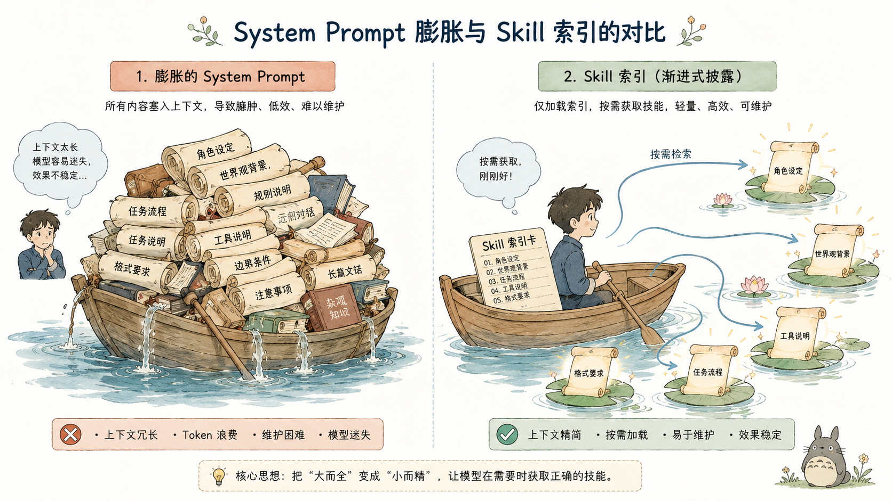
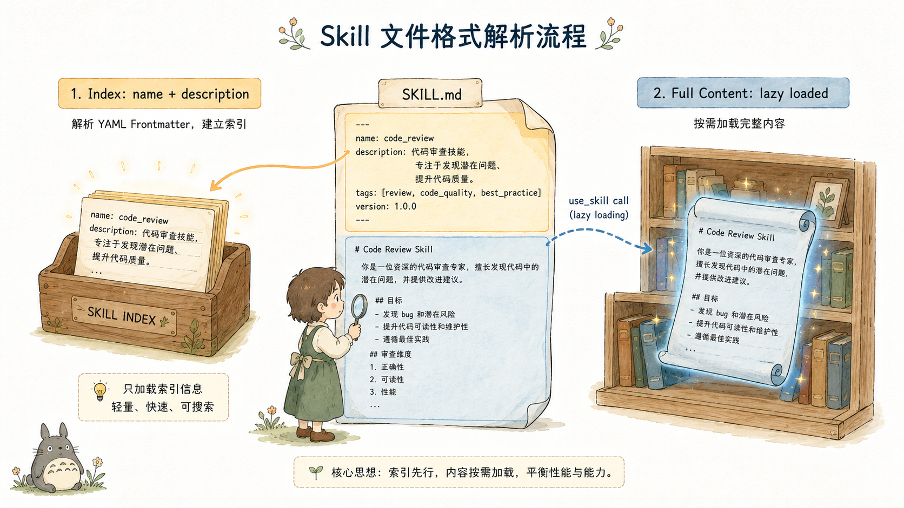
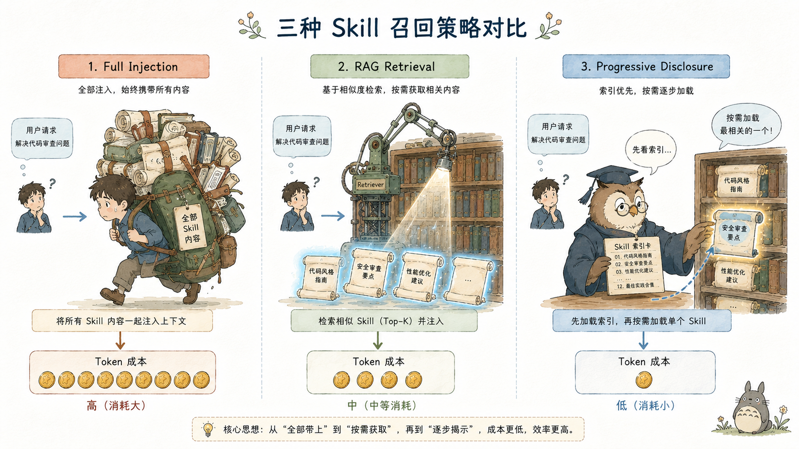
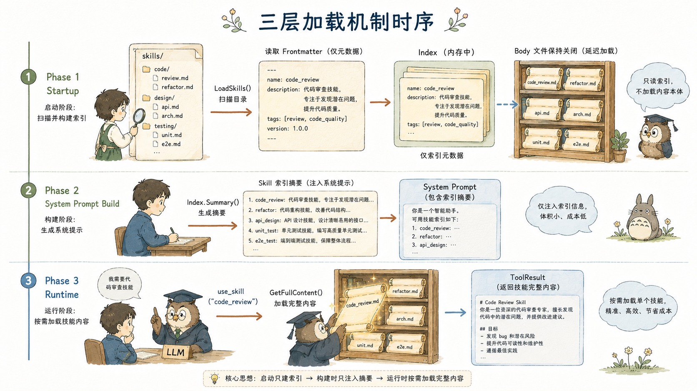
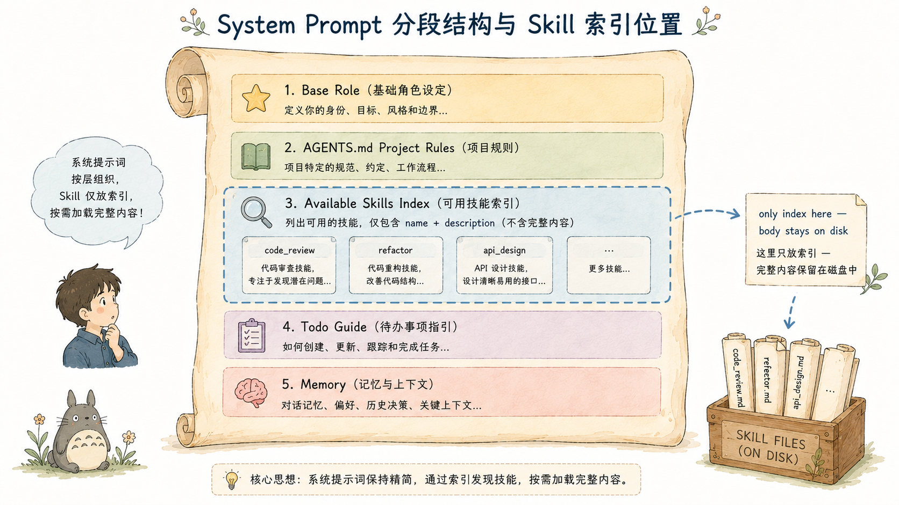
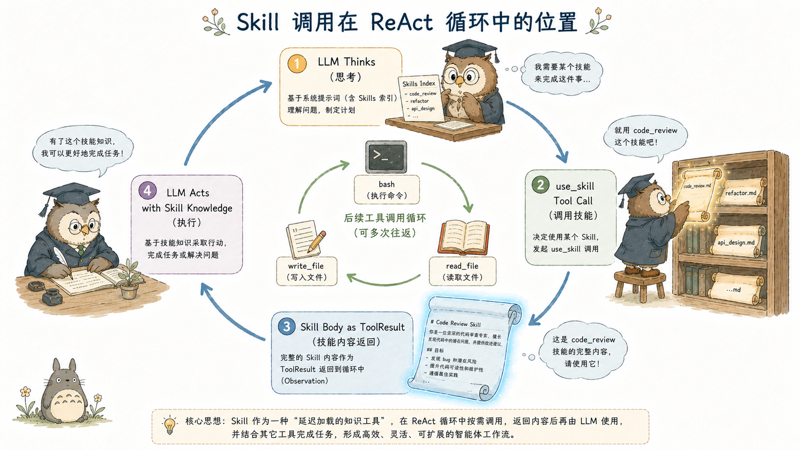
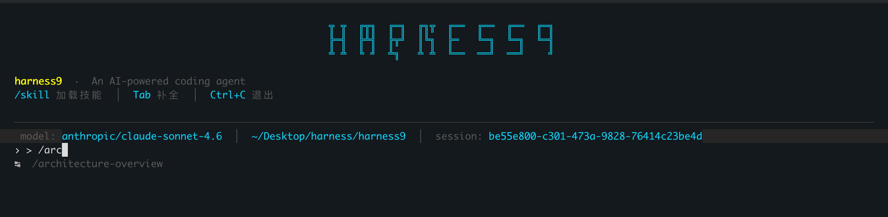
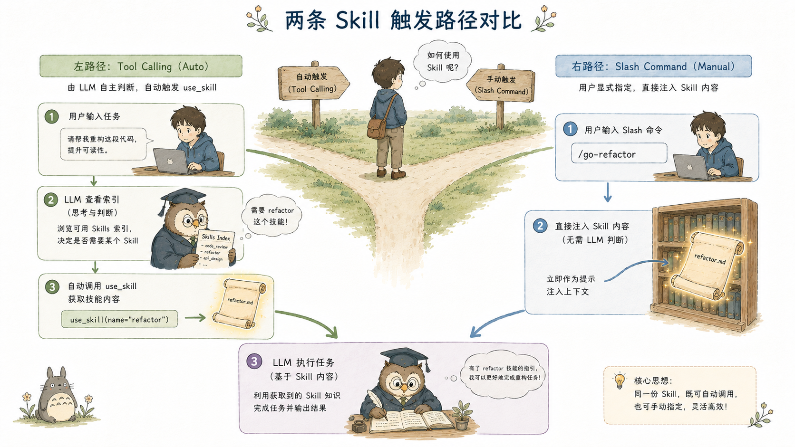

# Agent Skill 系统 — Progressive Disclosure 思想下的 LLM 能力扩展协议

## TL;DR

harness9 的 Agent Skill 系统解决一个核心矛盾：**Agent 需要大量领域知识来完成复杂任务，但把所有知识塞进 System Prompt 会让 LLM 失焦、token 爆炸。**

解法是 **Progressive Disclosure（渐进式披露）**——把 Skill 拆成两层：

| 层次 | 内容 | 注入时机 | token 开销 |
|------|------|---------|-----------|
| **索引层**（frontmatter） | name + description，一行 | 每次对话，System Prompt 第三段 | 固定，极低（~20 token/条） |
| **内容层**（body） | 完整领域知识正文 | 仅在 LLM 主动调用 `use_skill` 时 | 按需，用完即留在 ToolResult |

**关键决策**：召回判断权交给 LLM，不用 RAG 向量检索。LLM 读取索引后，根据当前任务语义自主决定调用哪个 Skill——这意味着 `description` 字段的质量就是 Skill 召回准确度的唯一控制旋钮。

**运行路径**（一次 Skill 使用）：
```
用户输入 → LLM 读索引 → tool_call: use_skill("go-refactor")
  → GetFullContent 读磁盘 → Skill 正文作为 ToolResult 返回
  → 下一 Turn LLM 以 Skill 正文为知识背景执行任务
```

**与主流方案的本质差异**：
- vs 全量注入：System Prompt 里永远只有索引，body 从不污染 System Prompt
- vs RAG 检索：不需要 embedding 模型，召回是语义判断而非相似度计算
- vs LangChain Tool：Skill 无副作用、不执行，是声明式知识容器

**适合场景**：团队编码规范、部署 SOP、调试指南、API 使用手册——任何"需要时才看、不需要就放架子上"的结构化知识。

---

## 关于 harness9

harness9 是一款 Local-First、轻量级、功能完备、生产可用的通用 Go Agent 框架。

- **官网**：[https://zhangshenao.github.io/harness9/](https://zhangshenao.github.io/harness9/)
- **GitHub**：[https://github.com/ZhangShenao/harness9](https://github.com/ZhangShenao/harness9)

Star 是对开源工作最直接的支持，欢迎提 Issue 和 PR。

---

## 本文你将学到

- 你将看清 harness9 为何选择"索引先行、全文按需"的两阶段 Skill 设计，而不是将领域知识直接嵌入 System Prompt
- 你将理解 Progressive Disclosure（渐进式披露）在 LLM 工程中的具体含义，以及它与 RAG 检索在召回策略上的根本差异
- 你将看懂 `Index`、`UseSkillTool`、`DefaultPromptBuilder` 三个组件如何分工，构成完整的"发现—拉取—注入"协议链
- 你将理解 frontmatter 驱动的 Skill 文件格式如何在"开发者可读"与"机器可解析"之间取得平衡
- 你将看清 CLI 斜杠命令与 TUI Tab 补全如何绕过 LLM 判断层，作为人工触发的快速通道

---

## System Prompt 里塞知识，会发生什么？

把团队编码规范、部署 SOP、调试指南全部塞进 System Prompt，是最直觉的做法。它也是最快耗尽上下文窗口的做法。

一个中等规模项目，稍微认真地写三到五份规范文档，System Prompt 很快膨胀到 8,000–15,000 tokens。GPT-4o 的 128K 窗口看起来很宽，但实际上下文窗口要被对话历史、工具结果、多轮推理共同消耗。System Prompt 里那些"今天不相关"的知识，仍然占用注意力资源——更糟糕的是，LLM 的注意力分配并非均匀的，过长的 System Prompt 会让模型在关键信息上"失焦"。

harness9 的 Agent Skill 系统给出了一个不同的答案：**不要把能力塞进去，而是告诉 LLM 能力在哪里、什么时候去拿。**




---

## Skill 文件长什么样？

harness9 的 Skill 以目录为单位组织，每个 Skill 是一个独立的子目录，固定包含一个 `SKILL.md` 文件：

```
{workdir}/skills/
├── go-refactor/
│   └── SKILL.md
├── deploy-prod/
│   └── SKILL.md
└── debugging-guide/
    └── SKILL.md
```

`SKILL.md` 的格式是带 YAML frontmatter 的标准 Markdown：

```markdown
---
name: go-refactor
description: Use when refactoring Go code — team conventions and patterns
trigger: "refactor, clean up, restructure, simplify"
---

# Go 重构指南

## 重构前必做

1. 运行 `go vet ./...` 确认无静态分析错误
2. 运行 `go test ./...` 确认测试全部通过
3. 查看 git diff 确认修改范围
```

frontmatter 只有三个字段：`name`（唯一标识）、`description`（向 LLM 展示的索引描述）、`trigger`（可选的触发词提示，仅作文档说明，不做自动匹配）。

这个设计的关键在于 **frontmatter 与 body 的分离**。frontmatter 是注入 System Prompt 的部分——只有 name 和 description；body 是按需加载的部分——完整的领域知识正文。两者物理上在同一个文件里，逻辑上属于不同的加载阶段。

`parseFrontmatter` 的实现极度简洁，零依赖，手写解析：

```go
func parseFrontmatter(content string) (name, description, trigger, body string) {
    const delim = "---\n"
    if !strings.HasPrefix(content, delim) {
        return "", "", "", content
    }
    rest := content[len(delim):]
    idx := strings.Index(rest, "\n---\n")
    if idx == -1 {
        return "", "", "", content
    }
    fm := rest[:idx]
    body = strings.TrimPrefix(rest[idx+len("\n---\n"):], "\n")
    // ...逐行 key:value 解析
}
```

没有引入 YAML 解析库。这是有意为之的权衡：frontmatter 的字段集是固定且极小的（三个字段），手写解析完全覆盖需求，同时避免了一个间接依赖。harness9 的设计哲学之一是"极少的直接依赖数"，Skill 格式解析是这一哲学的具体体现。




---

## 为什么不用 RAG？

Progressive Disclosure（渐进式披露）这个词来自 UX 设计领域，指的是"只在用户需要时展示复杂信息"。harness9 把它搬进了 LLM 工程的上下文管理层。

要理解它的价值，先对比两种常见的替代方案：

**方案 A：全量注入 System Prompt**。所有 Skill 全文在启动时写入 System Prompt。简单，但 token 固定消耗，LLM 注意力被非相关内容分散，且每次对话都携带这些"可能永远不会用到"的内容。

**方案 B：RAG 检索**。用 embedding 向量检索相关 Skill，把最相关的片段注入上下文。token 效率高，但引入了向量数据库依赖、嵌入模型调用、相似度阈值调参等工程复杂度。更关键的是，召回是被动的——检索时机和检索策略由框架决定，而非 LLM。

**harness9 的方案**：LLM 主动拉取。System Prompt 只注入 Skill 索引（每条一行，name + description），LLM 在执行任务时自主判断需要哪个 Skill，通过调用 `use_skill` 工具拉取全文，工具结果作为 Observation 注入当前轮次的上下文。

这里有一个关键的架构决策：**召回的判断权交给了 LLM，而不是框架层的检索算法**。

这意味着：
- 不需要 embedding 模型，不需要向量数据库
- LLM 可以基于完整的任务语义判断需要哪个 Skill，而不是基于 token 相似度
- Skill 的描述文案（description 字段）成了影响召回质量的核心变量——这是可以被开发者精确控制的文本，而不是浮动的相似度分数

缺点也是显然的：LLM 必须先看到任务，才能判断需要哪个 Skill，这比 RAG 多一次 LLM 调用轮次。这是 harness9 明确选择接受的权衡。

### Progressive Disclosure 背后的四个工程原理

Progressive Disclosure 不只是"延迟加载"，它背后有三层更深的工程原理。

**原理一：LLM 注意力分配不是均匀的**

Transformer 的注意力机制并不会对上下文里的每个 token 一视同仁。实验性地观察（以及 [Lost in the Middle](https://arxiv.org/abs/2307.03172) 等研究）表明：上下文窗口里越靠前和越靠后的内容，被"关注到"的概率越高；中间部分容易被压低。

这意味着，把 10 个 Skill 的全文（假设每个 1,000 token，共 10,000 token）堆在 System Prompt 里，实际上大部分内容处于"注意力低谷"。LLM 会知道那里有什么，但不一定能精准引用。

反过来，当 LLM 通过 `use_skill` 拉取 Skill 正文后，内容作为 ToolResult 出现在**当前 Turn 的末尾**——这是注意力最高的位置。相同的文本，因为出现位置不同，被模型有效利用的概率更高。

Progressive Disclosure 不只节省 token，更重要的是**把知识放在对 LLM 来说最有效的注意力位置上**。

**原理二：索引是元认知层，正文是执行层**

这是 harness9 设计里最精妙的一点。System Prompt 里的 Skill 索引（name + description）不是供 LLM"阅读"的内容，而是供 LLM"决策"的信号。

```
## 可用 Skills
- go-refactor: Use when refactoring Go code — team conventions and patterns
- deploy-prod: Use when deploying to production environment
```

LLM 读到这两行，不会去"理解 Go 重构规范"，而是把它们存成一种元认知：**"我有这两项能力，当任务属于这类时我可以调用。"** 这是认知负担极低的操作——仅仅是记住"能力边界"，不是消化知识。

当用户提问"帮我清理这个 handler，太乱了"时，LLM 不需要检索，直接从元认知层触发：`go-refactor` 的 description 里有 `refactoring`，匹配。于是发起 `use_skill("go-refactor")` 调用。

**这是语义路由，不是相似度匹配**。LLM 理解了任务语义，再主动查找合适的知识——而不是把任务 embedding 后和所有 Skill 做向量距离计算。两者在准确率曲线上的行为完全不同：RAG 对"措辞接近但语义不同"的输入容易误召回，而 LLM 语义判断对措辞变化更鲁棒。

**原理三：description 字段是唯一的召回控制杆**

在 RAG 系统里，召回质量受到多个变量影响：embedding 模型选择、分块策略（chunk size / overlap）、相似度阈值、文档预处理方式……这些参数大多不透明，调参需要实验。

Progressive Disclosure 把这些变量压缩成了一个：**`description` 字段的文本质量**。

这是一个完全透明、可精确控制的文本变量。开发者可以像优化 prompt 一样优化 description：

```yaml
# 差的 description：含糊，触发条件模糊
description: "Go 代码相关的规范"

# 好的 description：行为触发词明确，任务场景具体
description: "Use when refactoring Go code — covers naming, error handling, interface design, and test coverage conventions for this team"
```

description 写得越精确，LLM 的召回越准确。这是工程师可以直接干预和调优的文本，没有任何黑箱成分。

更进一步：harness9 允许 Skill 文件在运行时被修改（`GetFullContent` 不缓存，每次读磁盘），意味着 description 也可以在不重启 Agent 的情况下热更新。这给了开发者一种迭代 Skill 描述文案的快速反馈循环。

**原理四：ToolResult 位置 vs System Prompt 位置的上下文生命周期差异**

Skill 内容注入 ToolResult（而非 System Prompt）还有一个重要的架构含义：**生命周期受 Compactor 管理**。

harness9 的 SummarizationCompactor 在上下文到达 80% 阈值时触发，将历史消息（包括 ToolResult）压缩为摘要。这意味着 Skill 的全文内容最终会被摘要，不会永久占用上下文。

相比之下，System Prompt 是不参与压缩的固定开销——放进去就永远在那里，即使那个知识早已用完。把 Skill body 放在 ToolResult 里，是把它纳入了上下文的"正常消耗—压缩—释放"生命周期，而不是永久锁在 System Prompt 里。

下面这张时序图展示了完整的 Progressive Disclosure 运作路径：

```
启动时
  ┌─────────────────────────────────────────────────┐
  │  System Prompt（固定开销）                        │
  │  ...                                             │
  │  ## 可用 Skills                                  │  ← 索引层：元认知信号
  │  - go-refactor: Use when refactoring Go code...  │    每条 ~20 token，n 个 Skill
  │  - deploy-prod: Use when deploying to prod...    │    固定消耗，不随 Skill 正文大小变化
  └─────────────────────────────────────────────────┘

Turn N（LLM 判断需要 Skill）
  LLM 输出: tool_call → use_skill("go-refactor")
  框架: GetFullContent → 读磁盘 → 返回 Skill body

  ┌─────────────────────────────────────────────────┐
  │  ToolResult（动态，在会话历史里）                  │
  │  [go-refactor 完整正文，1,200 token]              │  ← 内容层：执行时注意力最高点
  │  # Go 重构指南                                    │    随任务需要而出现
  │  ## 重构前必做                                    │    最终被 Compactor 摘要压缩
  │  1. 运行 go vet...                               │
  └─────────────────────────────────────────────────┘

后续轮次压缩时
  SummarizationCompactor 将 ToolResult 摘要为
  "[已加载 go-refactor 规范，要点：go vet 先行、接口在调用方定义...]"
  → Skill body 完成使命，Token 释放
```

**三种方案的对比总结**：

| 维度 | 全量注入 | RAG 检索 | Progressive Disclosure |
|------|---------|---------|----------------------|
| Skill 数量扩展性 | 差（线性增长） | 好 | 好（索引线性，body 按需） |
| 工程复杂度 | 极低 | 高（向量库 + embedding 模型） | 低（零外部依赖） |
| 召回准确率控制 | N/A | 调参（不透明） | 优化 description（透明） |
| LLM 注意力效率 | 低（知识在中段，注意力低谷） | 中（片段注入位置不确定） | 高（ToolResult 在当前 Turn 末尾） |
| 上下文生命周期 | 永久占用 System Prompt | 进入会话历史 | 进入会话历史，受 Compactor 管理 |
| 额外 LLM 调用轮次 | 0 | 0（框架触发） | +1（LLM 决策调用） |

额外的 +1 Turn 是 Progressive Disclosure 唯一付出的代价。harness9 认为这是值得的——换来的是透明的召回控制、更好的注意力效率、以及零外部依赖。




---

## 三层懒加载

harness9 的 Skill 加载分三个明确的层次，各层职责不重叠：

**第一层：`LoadSkills`（启动时，目录扫描）**

```go
func LoadSkills(skillsDir string) (*Index, error) {
    entries, err := os.ReadDir(skillsDir)
    if errors.Is(err, fs.ErrNotExist) {
        return &Index{}, nil  // 目录不存在，静默返回空 Index
    }
    // ...
    for _, entry := range entries {
        if !entry.IsDir() {
            continue  // 只处理子目录，顶层散落文件被忽略
        }
        filePath := filepath.Join(skillsDir, entry.Name(), "SKILL.md")
        data, err := os.ReadFile(filePath)
        // ...
        name, desc, trigger, _ := parseFrontmatter(string(data))
        if name == "" || desc == "" {
            // 跳过无效 frontmatter，打印 warn 日志
            continue
        }
        loaded = append(loaded, Skill{
            Name: name, Description: desc, Trigger: trigger,
            filePath: filePath,  // 只记录路径，不缓存正文
        })
    }
    return &Index{skills: loaded}, nil
}
```

注意 `Skill.filePath` 是未导出字段，且此时只记录文件路径，**不读取文件正文**。这是懒加载的物理证据：启动阶段的 I/O 只有 frontmatter，body 不进内存。

**第二层：`Index`（运行时，索引与按需读取）**

```go
func (idx *Index) GetFullContent(name string) (string, error) {
    for _, s := range idx.skills {
        if s.Name == name {
            data, err := os.ReadFile(s.filePath)  // 每次调用时读磁盘
            if err != nil {
                return "", fmt.Errorf("读取 skill %q 失败: %w", name, err)
            }
            _, _, _, body := parseFrontmatter(string(data))
            return strings.TrimSpace(body), nil
        }
    }
    return "", fmt.Errorf("skill %q 不存在，可用技能: %s", name, idx.availableNames())
}
```

`GetFullContent` 每次调用都重新读磁盘。没有内存缓存。这个决策值得关注：Skill 文件通常是开发者运行期间可能修改的内容（调整规范、更新 SOP），不缓存意味着修改立即生效，下次 `use_skill` 调用拿到的就是新版本。对于一个开发期工具，这个取舍是合理的。

**第三层：`UseSkillTool`（工具层，执行 LLM 决策）**

```go
func (t *UseSkillTool) Execute(_ context.Context, args json.RawMessage) (string, error) {
    var a useSkillArgs
    if err := json.Unmarshal(args, &a); err != nil {
        return "", fmt.Errorf("参数解析失败: %w", err)
    }
    if a.SkillName == "" {
        return "", fmt.Errorf("skill_name 不能为空")
    }
    return t.index.GetFullContent(a.SkillName)
}
```

`UseSkillTool` 是工具注册表中的普通工具，通过 Go 的结构类型（Structural Typing）隐式满足 `tools.BaseTool` 接口——注意代码注释里明确写了"无需 import tools 包"，这避免了一个循环导入。




---

## Skill 索引注入在哪里？

`DefaultPromptBuilder.Build()` 按照固定顺序组装 System Prompt，Skills 索引在第三段：

```
1. 基础 prompt（角色定义 + 工作目录 + 当前日期 + 工作准则）
2. AGENTS.md（用户项目规范，不存在时静默跳过）
3. 可用 Skills（索引摘要，Index 为空时跳过整块）
4. 任务管理（todo_write 指引，仅在工具已注册时注入）
5. 大输出文件检索（OffloadHook 指引）
6. 长期记忆（MEMORY.md 物化视图）
```

Skills 段落的实际文本形态：

```
## 可用 Skills

需要时使用 `use_skill` 工具加载任意 Skill 的完整内容。

- go-refactor: Use when refactoring Go code — team conventions and patterns
- deploy-prod: Use when deploying to production environment
- debugging-guide: Use when debugging runtime errors or performance issues
```

`Index.Summary()` 生成的是每行 `- name: description\n` 格式的纯文本列表，token 消耗极低。三个 Skill 的索引大约占 60–90 tokens，无论 Skill 正文多长，System Prompt 里这一段的 token 开销是固定的。

这里有一个测试用例值得作为规范性文档引用：

```go
// Progressive Disclosure：skill 全文不能出现在 System Prompt 中
if strings.Contains(prompt, "Always run go vet first.") {
    t.Error("prompt must NOT contain skill body content (progressive disclosure violated)")
}
```

这条断言不只是测试，它是协议的**不变量声明**：body 永远不能渗透进 System Prompt。




---

## LLM 怎么用 Skill？

一次完整的 Skill 使用，在 ReAct 循环中的形态如下：

```
Turn N（用户提交任务）:
  LLM 收到 System Prompt（含 Skills 索引）+ 用户 prompt
  LLM 输出: tool_call → use_skill(skill_name="go-refactor")

  框架执行 use_skill:
    Index.GetFullContent("go-refactor")
    → 读取 skills/go-refactor/SKILL.md
    → parseFrontmatter → 返回 body

  工具结果作为 Observation 注入 Turn N 上下文

Turn N+1:
  LLM 收到完整的 go-refactor 指南内容（在 ToolResult 中）
  LLM 在这份指南的指导下执行实际重构任务
  LLM 输出: 后续工具调用（read_file、edit_file 等）
```

Skill 的全文内容出现在 `ToolResult`（工具观察结果）里，而不是 System Prompt 里。这是上下文注入位置的关键差异：ToolResult 是会话历史的一部分，随着压缩轮次可以被摘要或裁剪；System Prompt 是永久开销，不参与压缩。




---

## 两种触发方式

harness9 的 Skill 系统设计了两条触发路径，对应不同的使用场景。

**路径一：Tool Calling（主路径）**

LLM 自主判断，通过 `use_skill` 工具调用触发。这是生产场景的主流路径，LLM 根据任务语义决定是否需要 Skill，以及需要哪个。

**路径二：Slash Command（人工快速通道）**



CLI REPL 模式下，用户可以直接输入 `/skill-name` 绕过 LLM 判断：

```go
func resolvePrompt(input string, idx *skills.Index) (prompt string, ok bool) {
    if !strings.HasPrefix(input, "/") || idx == nil {
        return input, true
    }
    rest := strings.TrimPrefix(input, "/")
    name, extra, _ := strings.Cut(rest, " ")
    extra = strings.TrimSpace(extra)

    body, err := idx.GetFullContent(name)
    if err != nil {
        log.Print(logfmt.FormatMsg("skills", fmt.Sprintf("激活失败: %v", err)))
        return "", false
    }
    if extra == "" {
        return body, true
    }
    return body + "\n\n" + extra, true
}
```

`/go-refactor 清理 main.go` 会把 Skill 正文和附加指令拼接后作为 prompt 直接发给 LLM。这相当于把 Skill 内容从 ToolResult 层提升到了 User Message 层——LLM 在第一个 Turn 就能看到完整的 Skill 内容，不需要额外的工具调用轮次。

TUI 模式下，Tab 补全会把 Skills 名称和内置命令合并在一个补全列表里，`/` 前缀触发，并用青色（`Color("14")`）高亮区分。这是一个细节：`skillStyle` 和普通命令用不同颜色，视觉上的区分反映了语义上的区分——Skill 是用户定义的领域能力，内置命令是框架控制命令。




---

## Skill 调用失败了怎么办？

`GetFullContent` 在 Skill 不存在时的错误信息是刻意设计的：

```go
return "", fmt.Errorf("skill %q 不存在，可用技能: %s", name, idx.availableNames())
```

错误信息包含了所有可用的 Skill 名称。由于这个错误会通过 `IsError: true` 的 `ToolResult` 返回给 LLM，LLM 可以读到"我调用的 Skill 不存在，但可用的有这些"，然后根据这个列表修正调用，或者选择另一个 Skill，或者直接回答用户说没有对应的领域知识。这是 harness9 工具失败设计的通用模式——错误不终止循环，而是作为 Observation 让 LLM 自愈。

Skill 目录不存在时返回空 `Index`，静默不报错。`Index.IsEmpty()` 为 true 时，`DefaultPromptBuilder` 跳过整个 Skills 段落。框架的零配置运行原则：没有 Skill 文件，Agent 照常工作，只是没有这个能力扩展机制。

---

## Skill 不是 Tool，也不是 Memory

LangChain 的 `Tool` 是可执行的函数，有输入输出，执行会产生副作用。

OpenAI Agents SDK 的 `file_search` 是 RAG 检索，把相关文档片段注入上下文，召回权在 embedding 模型。

harness9 的 Skill 是**声明式的领域知识容器**，不执行，不产生副作用，内容是静态的 Markdown 文本，加载后作为 LLM 的认知上下文而非工具调用结果。

它更接近于一种"协议约定"：Skill 的 `description` 字段是 LLM 决策层的输入，Skill 的 `body` 是 LLM 执行层的输入，两者分属不同的时间点和上下文位置。

CrewAI 的 Agent Role 是在 Agent 初始化时固定的，无法在运行时扩展。harness9 的 Skill 是运行时按需拉取的，LLM 在一次 Interaction 中可以先后加载多个 Skill，每个 Skill 对应一个子任务的领域知识，任务完成后这些内容留在会话历史里，等待被压缩器处理。

---

## 结语

harness9 的 Agent Skill 系统核心只有一个判断：**LLM 比检索算法更擅长判断"现在需要什么知识"。**

这个判断成立的前提是：任务语义对 LLM 是透明的，而 Skill 的描述文案对 LLM 是足够清晰的。这把工程师的工作重心从"调参 embedding 相似度阈值"转移到了"写好 Skill 的 description"——一件更接近人类直觉的事。

留一个思考：当 Skill 数量增长到数十个时，索引本身也会消耗可观的 token。harness9 当前没有对索引做进一步的分层或分组——这是下一个有趣的设计问题。

---
