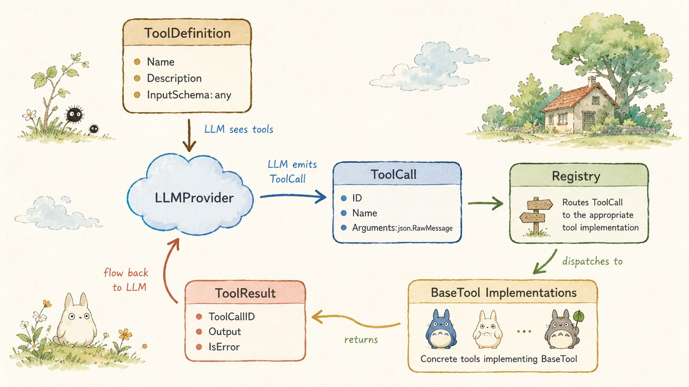
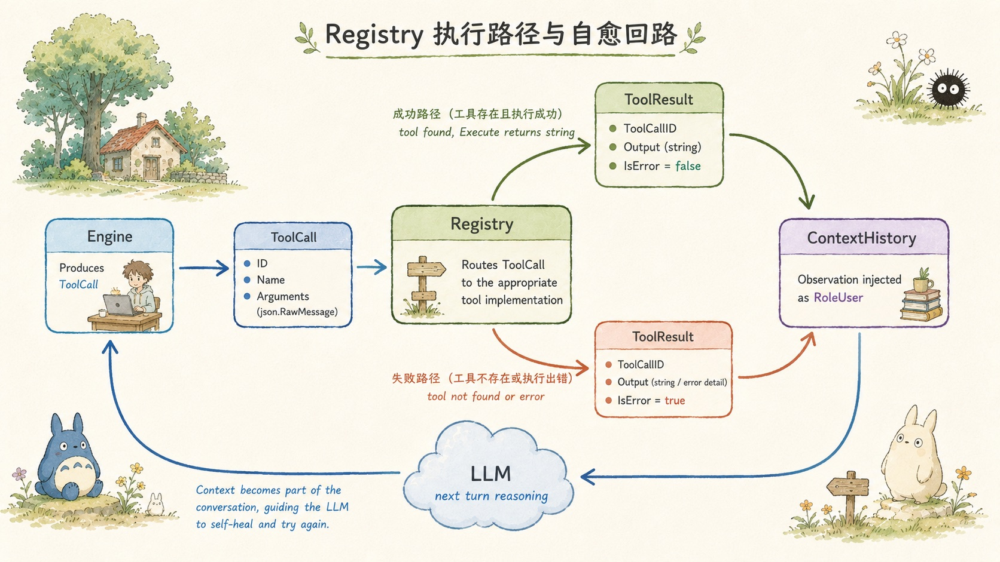
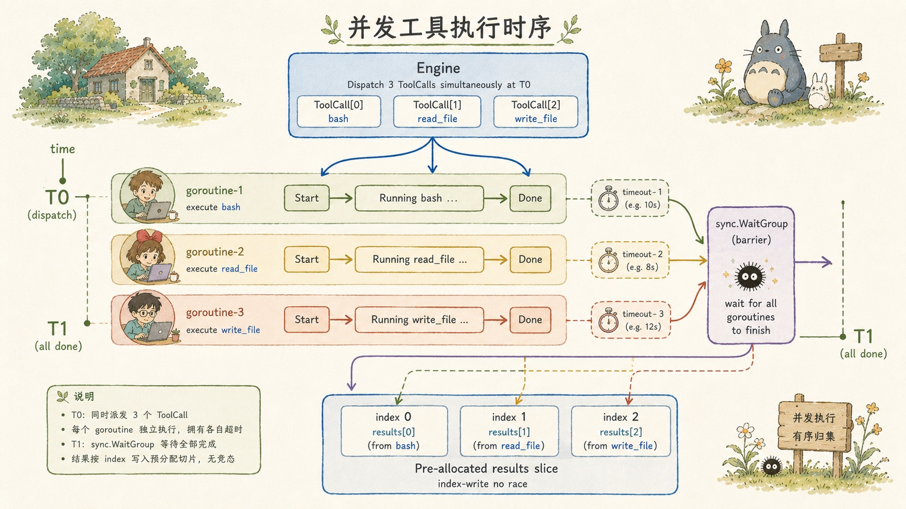
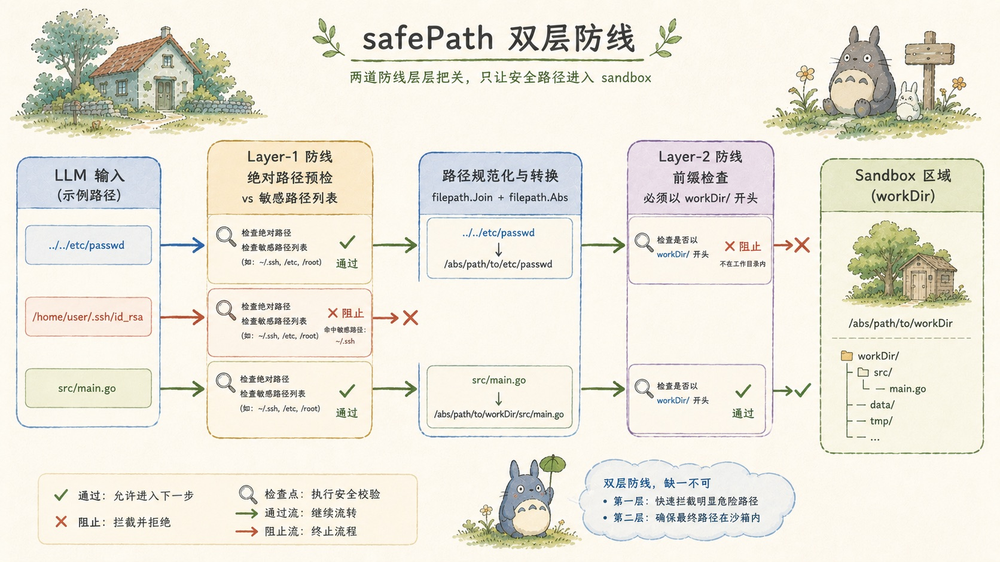
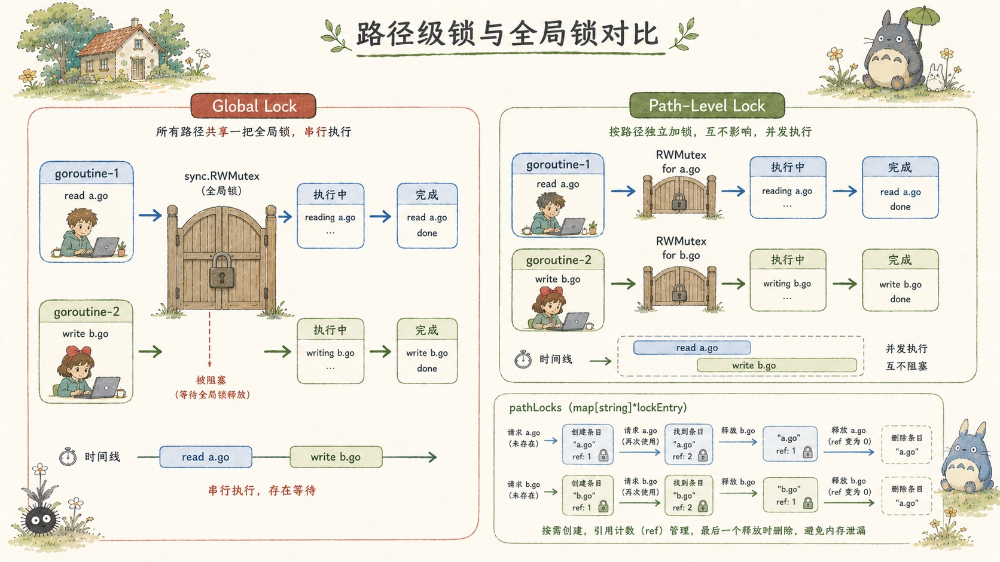
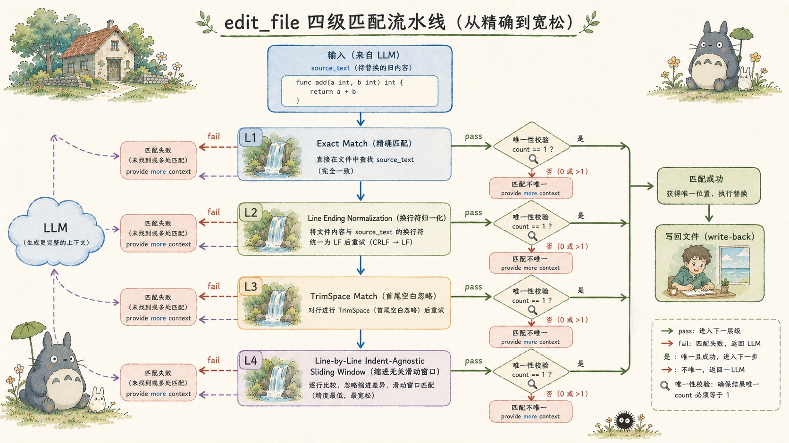
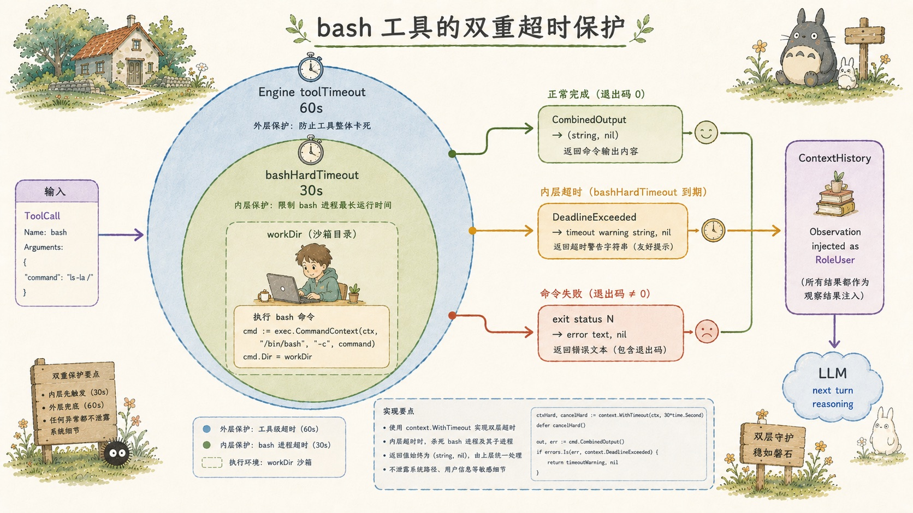
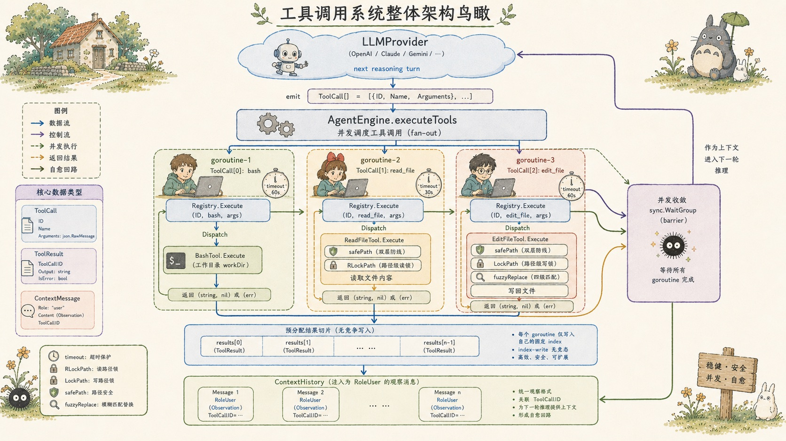

# harness9 工具调用系统 — 从接口契约到并发沙箱的工程实践

## 关于 harness9

harness9 是一款轻量、完备、生产可用的 Go 语言 Agent Harness 框架。

- **官网**：[https://zhangshenao.github.io/harness9/](https://zhangshenao.github.io/harness9/)
- **GitHub**：[https://github.com/ZhangShenao/harness9](https://github.com/ZhangShenao/harness9)

Star 是对开源工作最直接的支持，欢迎提 Issue 和 PR。

---

## TL;DR

harness9 的工具调用（Tool Calling）系统围绕三个核心决策展开：**接口在使用者侧定义**、**并发执行保序写入**、**错误原样回传触发自愈**。路径沙箱与路径级读写锁是生产可用的安全底线，edit_file 的四级模糊匹配是对 LLM 输出不稳定性的系统性对抗。

---

## 一、数据类型层：三个类型撑起整个协议

工具调用系统的契约从 `internal/schema/message.go` 中三个类型出发。

```go
type ToolCall struct {
    ID        string
    Name      string
    Arguments json.RawMessage // 延迟反序列化，解析责任在具体工具
}

type ToolResult struct {
    ToolCallID string
    Output     string
    IsError    bool  // true 时引擎将错误原文回传给 LLM
}

type ToolDefinition struct {
    Name        string
    Description string
    InputSchema any   // 各 Provider 自行适配 SDK 类型
}
```

`Arguments` 使用 `json.RawMessage` 是一个蓄意的设计选择。引擎层不知道、也不需要知道每个工具的参数结构。类型安全边界被推迟到工具实现内部，代价是每个工具都要自行调用 `json.Unmarshal`，收益是引擎与工具完全解耦——新增工具不需要改引擎任何一行代码。

`InputSchema` 使用 `any` 同理。内置工具以 `map[string]interface{}` 形式声明 JSON Schema，各 Provider 适配器再把它转换为自家 SDK 要求的类型（OpenAI 的 `shared.FunctionParameters`、Anthropic 的 `map[string]any`），schema 包本身不感知厂商差异。




---

## 二、接口层：定义在使用者侧

harness9 的接口设计遵循 Go 惯例：接口声明在依赖方，而非实现方。

`BaseTool` 接口定义在 `internal/tools/base.go`，`Registry` 接口也在同一个包：

```go
type BaseTool interface {
    Name() string
    Definition() schema.ToolDefinition
    Execute(ctx context.Context, args json.RawMessage) (string, error)
}

type Registry interface {
    Register(tool BaseTool) error
    GetAvailableTools() []schema.ToolDefinition
    Execute(ctx context.Context, call schema.ToolCall) schema.ToolResult
}
```

引擎包（`internal/engine`）依赖 `tools.Registry` 接口，而非 `registryImpl` 具体类型。这意味着测试时可以注入任意 mock，生产代码不需要任何改动。

`Registry.Execute` 的签名值得注意——它接收 `schema.ToolCall`，返回 `schema.ToolResult`，而不是 `(string, error)`。这个封装在注册表层完成了一次关键的语义转换：工具执行失败不再是 Go 层面的 `error`，而是 `IsError=true` 的 `ToolResult`。引擎可以把这条失败记录作为普通 Observation 注入上下文，LLM 在下一轮推理时看到错误信息，自行决定如何处理。

```go
func (r *registryImpl) Execute(ctx context.Context, call schema.ToolCall) schema.ToolResult {
    tool, exists := r.tools[call.Name]
    if !exists {
        return schema.ToolResult{
            ToolCallID: call.ID,
            Output:     fmt.Sprintf("Error: 系统中不存在名为 '%s' 的工具。", call.Name),
            IsError:    true,
        }
    }
    output, err := tool.Execute(ctx, call.Arguments)
    if err != nil {
        return schema.ToolResult{
            ToolCallID: call.ID,
            Output:     fmt.Sprintf("Error executing %s: %v", call.Name, err),
            IsError:    true,
        }
    }
    return schema.ToolResult{ToolCallID: call.ID, Output: output}
}
```

错误不终止循环，错误是下一轮推理的原材料——这是 harness9 自愈（Self-Healing）能力的物质基础。




---

## 三、并发执行模型：预分配切片 + 索引写入

主流 LLM（GPT、Claude）可以在单次响应中发出多个 `ToolCall`。harness9 在引擎层并发执行它们：

```go
func (e *AgentEngine) executeTools(ctx context.Context, turn int,
    toolCalls []schema.ToolCall, logPrefix string, em emitter) []schema.ToolResult {

    results := make([]schema.ToolResult, len(toolCalls)) // 预分配
    var wg sync.WaitGroup

    var sem chan struct{}
    if e.maxConcurrentTools > 0 {
        sem = make(chan struct{}, e.maxConcurrentTools) // 并发度限制
    }

    for i, toolCall := range toolCalls {
        wg.Add(1)
        go func(idx int, tc schema.ToolCall) {
            defer wg.Done()
            if sem != nil {
                sem <- struct{}{}
                defer func() { <-sem }()
            }
            toolCtx := ctx
            var cancel context.CancelFunc
            if e.toolTimeout > 0 {
                toolCtx, cancel = context.WithTimeout(ctx, e.toolTimeout)
                defer cancel()
            }
            // ...
            results[idx] = e.registry.Execute(toolCtx, tc) // 索引写入
        }(i, toolCall)
    }
    wg.Wait()
    return results
}
```

两个并发安全细节值得单独拎出来说：

**预分配 + 索引写入**：`results` 在启动 goroutine 之前就已分配好长度，每个 goroutine 通过闭包捕获的 `idx` 写入固定位置，不同 goroutine 写不同槽位，无竞态条件，也不需要任何锁。Go 的内存模型保证这种模式是安全的。

**每工具独立超时**：每个 goroutine 内部通过 `context.WithTimeout(ctx, e.toolTimeout)` 创建子上下文。一个工具超时只会取消自己的子上下文，不会影响同 Turn 内其他工具的执行。这是 `toolCtx` 而非共享 `ctx` 传给 `registry.Execute` 的原因。

并发度通过 `maxConcurrentTools` 选项控制——信道作信号量，`sem <- struct{}{}` 阻塞表示占位，`<-sem` 释放槽位。设为 0 时不限制并发度。

引擎的默认配置是 `maxTurns=50, toolTimeout=60s`，为生产场景提供合理的上限兜底。




---

## 四、路径沙箱：safePath 的两层防线

`bash` 工具不做命令限制，`read_file` 和 `write_file` 则受到 `safePath` 保护。两者的安全哲学截然不同，但都是刻意的选择。

`safePath` 的核心逻辑在 `internal/tools/safe_path.go`：

```go
func safePath(workDir, inputPath string) (string, error) {
    // 绝对路径输入先检：在 Join 前直接拦截敏感路径
    if filepath.IsAbs(inputPath) {
        cleanInput := filepath.Clean(inputPath)
        if isSensitivePath(cleanInput) {
            return "", fmt.Errorf("路径 '%s' 是受保护的敏感路径，禁止访问", inputPath)
        }
    }

    cleanWorkDir := filepath.Clean(workDir)
    joined := filepath.Join(cleanWorkDir, inputPath)
    absPath, err := filepath.Abs(joined)
    // ...

    // 前缀必须是 cleanWorkDir + PathSeparator，不能只是 cleanWorkDir
    // 否则 "/project-evil" 会被误判为 "/project" 的合法子路径
    if !strings.HasPrefix(absPath, cleanWorkDir+string(os.PathSeparator)) && absPath != cleanWorkDir {
        return "", fmt.Errorf("路径 '%s' 超出工作区范围", inputPath)
    }

    if isSensitivePath(absPath) { // 二次检查：Join 后再过一遍
        return "", fmt.Errorf("路径 '%s' 是受保护的敏感路径，禁止访问", inputPath)
    }
    return absPath, nil
}
```

两层防线各有针对的攻击向量：

第一层（绝对路径预检）针对直接提供绝对路径的情形，在 `filepath.Join` 前就拦截，防止攻击者通过 `/home/user/.ssh/id_rsa` 绕过相对路径沙箱。

第二层（Join 后前缀校验）针对 `../../etc/passwd` 这类相对路径穿越。`filepath.Abs` 会把 `Join("/project", "../../etc/passwd")` 解析成 `/etc/passwd`，然后前缀校验发现它不以 `/project/` 开头，直接拒绝。

注释里那个 `/project-evil` 细节是真实 bug 的防范——纯字符串前缀匹配时 `/project-evil` 会通过 `/project` 的检查，但加上 `PathSeparator` 就不会了。

硬编码的敏感路径列表包含 `~/.ssh`、`~/.aws`、`~/.kube`、`~/.gnupg`、`~/.netrc`、`~/.config/gcloud`——这些是凭证泄漏风险最高的目录，无论 `workDir` 设置成什么都会被拒绝。




---

## 五、路径级锁：比全局锁细一个量级

`safePath` 防的是越界，路径级读写锁防的是同一文件上的并发竞争。

`internal/tools/path_locker.go` 实现了一套引用计数的路径粒度锁：

```go
type pathLock struct {
    rw  *sync.RWMutex
    ref int
}

var (
    pathLocksMu sync.Mutex
    pathLocks   = make(map[string]*pathLock)
)

func RLockPath(path string) func() {
    l := getOrCreatePathLock(path) // ref++
    l.rw.RLock()
    return func() {
        l.rw.RUnlock()
        releasePathLock(path, l) // ref--，归零时从 map 删除
    }
}
```

使用侧极其简洁：

```go
// read_file.go
unlock := RLockPath(fullPath)
defer unlock()

// write_file.go / edit_file.go
unlock := LockPath(fullPath)
defer unlock()
```

这个设计的关键属性：

不同路径之间完全无竞争。同时读取 `a.go` 和 `b.go` 的两个 goroutine 拿到的是不同的 `RWMutex`，互不阻塞。只有操作同一路径的并发调用才会发生锁竞争。

引用计数解决了 map 的无限膨胀问题。没有活跃使用者的路径条目会从 `pathLocks` 中删除，不会因为历史操作路径数量增长而导致内存泄漏。

`getOrCreatePathLock` 和 `releasePathLock` 都用 `pathLocksMu` 互斥保护 map 操作，确保 `ref++` 和 `ref--` 的原子性。

与全局 `sync.RWMutex` 相比，路径级锁的优势在吞吐量上：LLM 同时调用 `read_file("a.go")` 和 `write_file("b.go")` 时，两个操作可以完全并行。




---

## 六、edit_file 的四级模糊匹配

`edit_file` 是内置工具中设计最复杂的一个，它解决的问题是：LLM 生成的 `source_text` 和文件里的实际内容经常不完全一样。

四级容错流水线（Four-Level Fallback Pipeline）在 `fuzzyReplace` 函数中展开：

```go
// L1: 精确匹配
count := strings.Count(originalContent, sourceText)
if count == 1 {
    return strings.Replace(originalContent, sourceText, targetText, 1), nil
}
if count > 1 {
    return "", fmt.Errorf("source_text 匹配到了 %d 处，请提供更多的上下文代码以确保唯一性", count)
}

// 进入 L2-L4，先做换行符归一化
normalizedContent := strings.ReplaceAll(originalContent, "\r\n", "\n")
normalizedSource := strings.ReplaceAll(sourceText, "\r\n", "\n")

// L2: 换行符归一化匹配
count = strings.Count(normalizedContent, normalizedSource)
if count == 1 { /* 替换，按需恢复 \r\n */ }

// L3: 整体首尾去空
trimmedSource := strings.TrimSpace(normalizedSource)
if trimmedSource != "" {
    count = strings.Count(normalizedContent, trimmedSource)
    if count == 1 { /* 替换 */ }
}

// L4: 逐行去缩进滑动窗口匹配
return lineByLineReplace(normalizedContent, normalizedSource, normalizedTarget, hasCRLF)
```

每一级都有唯一性校验（Uniqueness Guard）：count > 1 时直接返回错误，要求 LLM 提供更多上下文，而不是猜测匹配哪一处。这避免了"错改正确代码"这类沉默的破坏性错误。

L4 的逐行去缩进是最后的容错防线，专门应对 LLM 对缩进的不稳定输出。它用滑动窗口逐行比较 `strings.TrimSpace` 后的内容，容忍空格和 Tab 的差异。

换行风格保留是一个细节：L2 及以下的替换在归一化内容（`\n`）上完成，写回前检查原始文件是否含 `\r\n`，如果有就恢复，确保跨平台兼容。

这套机制的工程意义在于：LLM 不需要完美地复现代码格式，框架会帮它找到最接近的匹配。同时，唯一性校验确保这种"宽容"不会变成"危险"。




---

## 七、bash 工具的 YOLO 哲学与双重超时

`bash` 工具与其他文件工具在安全哲学上完全不同。它不做路径沙箱，也不做命令白名单。

```go
const bashHardTimeout = 30 * time.Second

func (t *BashTool) Execute(ctx context.Context, args json.RawMessage) (string, error) {
    // ...
    timeoutCtx, cancel := context.WithTimeout(ctx, bashHardTimeout)
    defer cancel()

    cmd := exec.CommandContext(timeoutCtx, "bash", "-c", input.Command)
    cmd.Dir = t.workDir
    out, err := cmd.CombinedOutput()

    if timeoutCtx.Err() == context.DeadlineExceeded {
        return outputStr + "\n[警告: 命令执行超时(30s)，已被系统强制终止。]", nil
    }
    if err != nil {
        // 注意：返回 (string, nil)，不是 (string, error)
        return fmt.Sprintf("执行报错: %v\n输出:\n%s", err, outputStr), nil
    }
    // ...
}
```

三个设计点：

`bash -c` 包裹支持完整 Shell 语法——管道、逻辑与、环境变量、重定向，LLM 不需要拆分命令。

双重超时兜底：引擎层的 `toolTimeout`（默认 60s）和工具内的 `bashHardTimeout`（30s），实际生效的是两者中较短的那个。这是针对 `tail -f`、`top`、Web 服务等阻塞型命令的"安全网"。

命令失败时返回 `(string, nil)` 而非 `(string, error)`——这是 YOLO 哲学的实现细节。返回 `nil` 意味着 Registry 会生成 `IsError=false` 的 `ToolResult`，错误内容（包含 exit code 和 stderr）作为普通文本进入上下文，LLM 阅读后自行决策。不做半吊子沙箱：bash 工具本质上提供完整 shell 访问，加 `cd /` 就能逃逸 workDir，做命令白名单只是制造安全假象。如果需要路径安全，用 `read_file` 和 `write_file`。




---

## 八、工具系统的整体鸟瞰

把上面所有层次拼在一起：

```
LLM Provider
    │ ToolCall[]（含 json.RawMessage Arguments）
    ▼
AgentEngine.executeTools
    ├── goroutine[0] → toolCtx（独立超时）→ Registry.Execute → BashTool
    ├── goroutine[1] → toolCtx（独立超时）→ Registry.Execute → ReadFileTool
    │                                             └── safePath → RLockPath → os.Open
    └── goroutine[2] → toolCtx（独立超时）→ Registry.Execute → EditFileTool
                                                  └── safePath → LockPath → fuzzyReplace
    ↓ sync.WaitGroup.Wait()
results[0..n]（预分配，无竞态）
    │ IsError=true 时原样回传
    ▼
ContextHistory（RoleUser + ToolCallID 关联）
    │
    ▼
下一轮 LLM 推理
```




---

## 结语

harness9 的工具调用系统是框架"简洁但完备"原则的缩影：3 个核心类型、2 个接口、1 个并发执行函数，加上 safePath 和路径级锁构成的安全底座，edit_file 的四级模糊匹配应对 LLM 输出的不确定性。

值得思考的问题：当工具数量增长到数十个、LLM 每次可能发出 10 个并发调用时，`maxConcurrentTools` 和 `toolTimeout` 的最优配置是什么？这个问题的答案，很大程度上取决于具体工具的 I/O 特性和模型的调用习惯。
